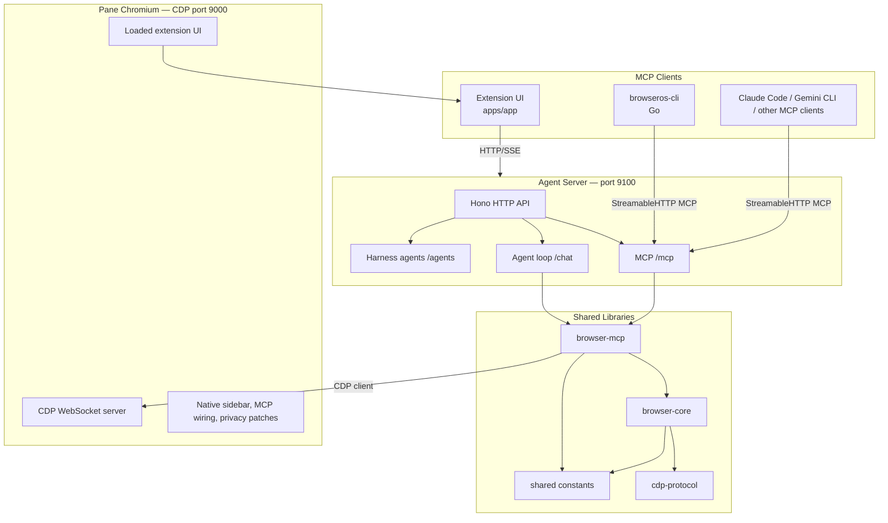
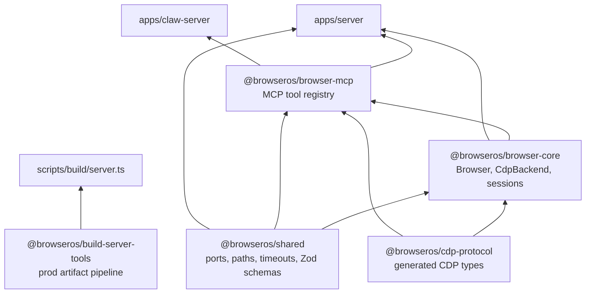
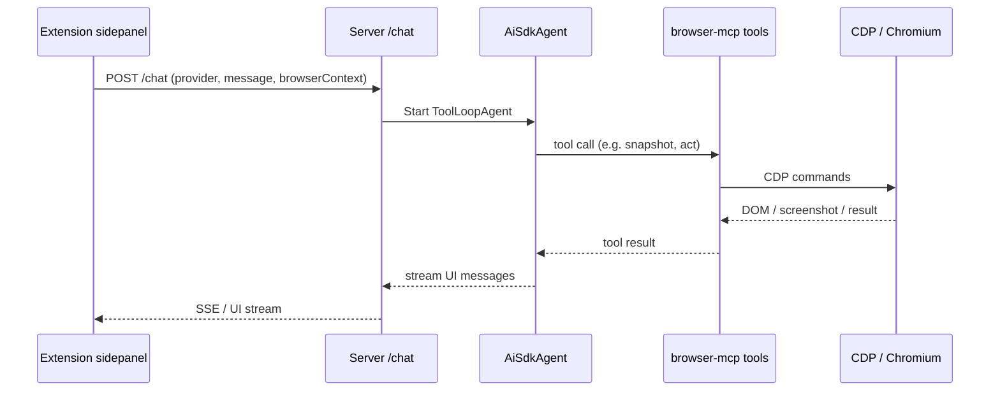
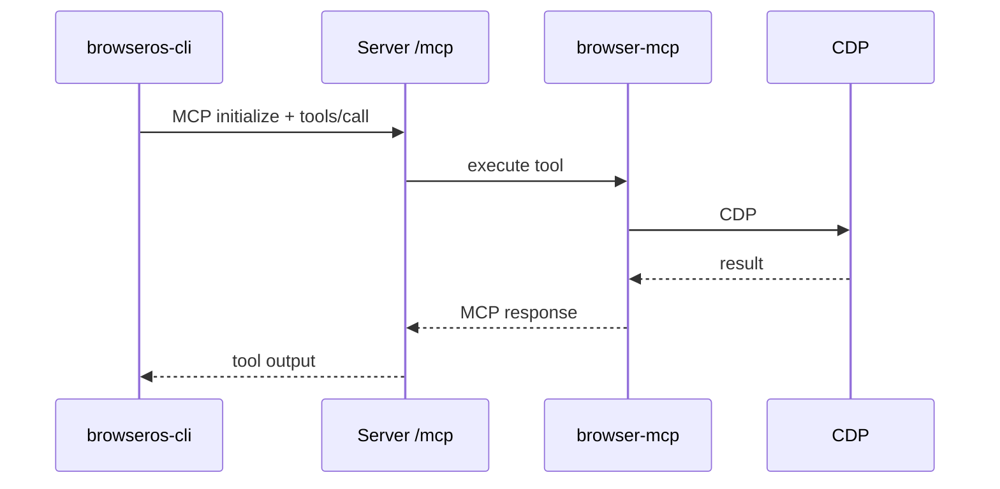

# Pane Architecture

Pane is an open-source Chromium fork with a native AI agent platform. The product runs browser automation through MCP (Model Context Protocol), an AI agent loop, and a Chrome extension UI — all local-first, with optional cloud sync for settings and history.

This document describes the **Pane** workspace layout: a monorepo containing the Chromium browser build system and the TypeScript/Go agent platform.

---

## Table of Contents

1. [Repository Layout](#repository-layout)
2. [System Overview](#system-overview)
3. [Browser Subsystem](#browser-subsystem)
4. [Agent Platform Subsystem](#agent-platform-subsystem)
5. [Applications](#applications)
6. [Shared Packages](#shared-packages)
7. [Runtime Architecture](#runtime-architecture)
8. [Data Flows](#data-flows)
9. [MCP Tools](#mcp-tools)
10. [Configuration and Ports](#configuration-and-ports)
11. [Development Workflow](#development-workflow)
12. [Testing and Evaluation](#testing-and-evaluation)
13. [Build and Release](#build-and-release)
14. [CI/CD](#cicd)
15. [External Systems](#external-systems)
16. [Key File Index](#key-file-index)

---

## Repository Layout

```
Pane/                                    # Workspace root (Pane monorepo)
├── README.md                            # Product overview
├── ARCHITECTURE.md                      # This file
├── CONTRIBUTING.md
├── docs/                                # Public Mintlify docs (docs.browseros.com)
├── .github/workflows/                   # CI/CD (15 workflows)
├── .gitmodules                          # Private internal-docs submodule
│
└── packages/
    ├── browseros/                       # Chromium fork + Python build system (~100 GB)
    │   ├── build/                       # Python CLI (setup, apply, build, package, sign)
    │   ├── chromium_patches/            # Patches applied to Chromium source
    │   ├── chromium_files/              # New files injected into Chromium tree
    │   ├── series_patches/              # Ordered patch series
    │   ├── resources/                   # Icons, entitlements, signing assets
    │   └── CHROMIUM_VERSION             # Pinned Chromium version
    │
    └── browseros-agent/                 # Agent platform (Bun workspaces monorepo root)
        ├── apps/                        # Runnable applications
        ├── packages/                    # Shared libraries
        ├── scripts/                     # Build, codegen, release, test runners
        └── tools/                       # Go dev supervisor, dogfood CLI
```

**Important:** The agent monorepo root is `packages/browseros-agent/`. There is no root `package.json` at the Pane workspace level. All Bun commands for agent development run from `packages/browseros-agent/`.

**Private submodule:** `.internal-docs` (team-only ops and architecture notes) is configured in `.gitmodules` but may not be initialized in all clones.

---

## System Overview

Pane splits into two largely independent subsystems that connect at runtime through Chrome DevTools Protocol (CDP) and CLI launch flags.



| Subsystem | Language | Purpose |
|-----------|----------|---------|
| **Browser** (`packages/browseros/`) | C++ (Chromium), Python (build) | Custom Chromium with native agent integration, privacy patches, signing, OTA |
| **Agent platform** (`packages/browseros-agent/`) | TypeScript (Bun), Go | MCP server, AI agent loop, extension UI, CLI, eval harness |

---

## Browser Subsystem

**Path:** `packages/browseros/`

The browser package is a Python-orchestrated Chromium fork. It fetches Chromium source, applies Pane patches, and produces signed binaries for macOS, Windows, and Linux.

### What the browser adds

- Native AI agent sidebar and new-tab integration
- MCP server port wiring via launch flags and prefs
- Privacy enhancements (ungoogled-chromium lineage)
- Custom branding, icons, entitlements
- Sparkle auto-update (macOS)

### Build system

```bash
cd packages/browseros
pip install -e .          # or: uv pip install -e .

browseros setup           # Fetch Chromium source
browseros apply           # Apply patches
browseros build           # Compile
browseros package         # Package distributable
browseros sign            # Code signing
```

**Pinned version:** Chromium **146.0.7680.31** (see `CHROMIUM_VERSION`).

**Disk requirement:** ~100 GB for source and build artifacts.

### Patch layout

| Directory | Role |
|-----------|------|
| `chromium_patches/` | Unified diffs mirroring Chromium source tree |
| `chromium_files/` | Whole files added to the Chromium tree |
| `series_patches/` | Ordered patch application |
| `build/features.yaml` | Feature flag definitions |

Port defaults in Chromium prefs (`browseros_server_prefs.h`) stay in sync with TypeScript constants in `packages/shared/src/constants/ports.ts`.

### Dev vs production server embedding

- **Production:** Pane can bundle and launch the agent server internally.
- **Development:** `browseros-dev watch` passes `--disable-browseros-server` so an external Bun server (with hot reload) handles MCP and the agent loop.

---

## Agent Platform Subsystem

**Path:** `packages/browseros-agent/`

A Bun workspaces monorepo (`workspaces: ["apps/*", "packages/*"]`) pinned to **Bun 1.3.6**. All TypeScript uses extensionless imports and runs exclusively on Bun.

### Quality tooling

| Tool | Role |
|------|------|
| **Biome** | Lint and format |
| **fallow** | Unused exports, circular deps, type leaks |
| **lefthook** | Git hooks |
| **tsgo** | TypeScript typecheck (app uses native preview) |

Root scripts:

```bash
bun run check          # lint + typecheck + fallow
bun run test           # full test suite (test:all)
bun run dev:setup      # deps, env, codegen
bun run dev:watch      # supervised dev environment
bun run build          # production server + extension
```

---

## Applications

All apps live under `packages/browseros-agent/apps/`.

### `@browseros/server` — MCP server and agent loop

| | |
|---|---|
| **Path** | `apps/server/` |
| **Stack** | Bun, Hono, Vercel AI SDK v6, Drizzle ORM, `@hono/mcp`, Sentry, PostHog |
| **Entry** | `src/index.ts` → `Application` in `src/main.ts` → `createHttpServer()` |

The server is the runtime hub. It connects to Chromium as a **CDP client**, registers MCP browser tools, runs the AI agent loop, persists sessions in SQLite, and exposes HTTP routes for the extension and external MCP clients.

**Startup sequence** (`src/main.ts`):

1. Load config (CLI > file > env > defaults)
2. Initialize DB, identity, metrics, agent runtimes (Claude/Codex)
3. Connect `CdpBackend` to the CDP port (required — exits if missing)
4. Wrap `Browser` + `BrowserSession`
5. Start Hono HTTP server with MCP tool registry
6. Write `~/.browseros/server.json` for discovery

**HTTP routes** (`src/api/routes/index.ts`):

| Route | Purpose |
|-------|---------|
| `/health`, `/status`, `/shutdown` | Lifecycle and diagnostics |
| `/mcp` | StreamableHTTP MCP (browser + filesystem tools) |
| `/mcp/nudge` | In-process MCP for app-connection nudges |
| `/mcp-manager` | MCP URL management |
| `/chat` | Streaming agent chat (AI SDK UI stream) |
| `/agents/*` | Harness agents, ACP sidepanel chat |
| `/oauth` | OAuth token flows (ChatGPT, Copilot, etc.) |
| `/klavis` | Managed MCP integrations |
| `/credits` | Credits gateway |
| `/remote-hermes` | Remote Hermes service |
| `/screencast` | Browser screencast |
| `/refine-prompt`, `/test-provider` | Provider utilities |

**Source layout:**

```
apps/server/src/
├── api/          Hono routes, middleware, services
├── agent/        AI SDK agent loop, providers, sessions, MCP client
├── browser/      Browser facade (wraps browser-core)
├── lib/          DB, identity, metrics, OAuth, clients
├── tools/        Server-specific tool wiring and filesystem tools
├── index.ts      Process entry
└── main.ts       Application lifecycle
```

---

### `@browseros/app` — Extension UI

| | |
|---|---|
| **Path** | `apps/app/` |
| **Stack** | WXT, React 19, Tailwind 4, TanStack Query, GraphQL codegen, React Router 7, AI SDK React |
| **Entry** | WXT entrypoints under `entrypoints/` |

Built-in Chrome extension providing the product UI:

| Entrypoint | Surface |
|------------|---------|
| `sidepanel/` | Chat interface (right side panel) |
| `app/` | New tab app: Home, Settings, Scheduled Tasks, MCP, onboarding |
| `newtab/` | Pane new tab experience |
| `onboarding/` | First-run flow |
| `background/` | Extension background service worker |
| `*.content*` | Page content scripts |

**Data sources:**

- **Local agent server** — chat, harness agents, health (`/chat`, `/agents/...`)
- **Cloud GraphQL API** — providers, sync, credits (`VITE_PUBLIC_BROWSEROS_API`)

Chat routing (`apps/app/modules/chat/chat-session-request.ts`):

- LLM mode → `POST {agentServerUrl}/chat`
- ACP harness mode → `POST {agentServerUrl}/agents/{id}/sidepanel/chat`

---

### `browseros-cli` — Go CLI

| | |
|---|---|
| **Path** | `apps/cli/` |
| **Stack** | Go 1.25+, Cobra, `@modelcontextprotocol/go-sdk` |
| **Config** | `~/.config/browseros-cli/config.yaml` (`server_url`) |

Terminal control of Pane via MCP. Commands map to MCP tools (`open`, `snapshot`, `click`, `batch`, `bookmark`, `history`, etc.) plus `launch`, `init`, `health`, `status`.

Each command opens an MCP session against `/mcp`, calls `tools/call`, and closes — same endpoint the extension and Claude Code use.

Distributed via npm shim (`apps/cli/npm/`) that downloads platform binaries from CDN on install.

---

### `@browseros/eval` — Benchmark harness

| | |
|---|---|
| **Path** | `apps/eval/` |
| **Stack** | Bun, Hono dashboard, Zod configs, Python graders |
| **Dashboard** | `http://localhost:9900` |

Runs WebVoyager, Mind2Web, AGI SDK, WebBench, and BrowseComp tasks. Spawns N browser workers, drives agents through MCP, captures trajectories and screenshots, grades results, and optionally publishes to R2.

**Agent types:** `single`, `orchestrator-executor`, `claude-code`

**CLI:**

```bash
bun run eval                              # Dashboard mode
bun run eval suite --config ... --publish r2
bun run eval grade --run results/...
```

---

### BrowserClaw stack (parallel product surface)

Three apps form an alternate agent UI stack on port **9200**:

| App | Path | Role |
|-----|------|------|
| `@browseros/claw-server` | `apps/claw-server/` | Standalone Hono API + MCP; config under `<browserosDir>/claw-server/` |
| `@browseros/claw-app` | `apps/claw-app/` | WXT extension cockpit (agents, governance, replay, live runs) |
| `@browseros/claw-onboard` | `apps/claw-onboard/` | Vite onboarding app; can embed in Chromium (`build:chromium`) |

Start with `bun run dev:claw:watch` from the agent monorepo root.

---

### Internal Go tools

| Tool | Path | Role |
|------|------|------|
| **browseros-dev** | `tools/dev/` | Dev supervisor: `watch`, `setup`, `cleanup`, `reset` |
| **browseros-dogfood** | `tools/dogfood/` | Internal macOS dogfood CLI |

The dev supervisor (`tools/dev/run.sh` → `browseros-dev watch`) orchestrates:

1. WXT HMR for `apps/app` (or static build in `--manual` mode)
2. Pane binary launch with dev flags (`--disable-browseros-server`, CDP/server/extension ports, `--load-extension`)
3. CDP readiness wait
4. `apps/server` with `bun --watch`

`--new` uses random ports in 9000–9999 and a fresh user-data directory.

---

## Shared Packages

All under `packages/browseros-agent/packages/`.



### `@browseros/shared`

Single source of truth for cross-package constants:

- `constants/ports.ts` — CDP, server, extension, OAuth callback ports
- `constants/paths.ts` — `~/.browseros/`, DB, sessions, tool output
- `constants/timeouts.ts`, `limits.ts`, `urls.ts`
- Zod schemas for LLM providers and UI streams

### `@browseros/cdp-protocol`

Auto-generated Chrome DevTools Protocol domain types and API wrappers. Regenerate with `bun run gen:cdp`.

### `@browseros/browser-core`

CDP connection layer:

- `CdpBackend` — WebSocket connection to Chromium CDP
- `Browser` / `BrowserSession` — tab management, snapshots, input
- Content markdown extraction, tab groups, mouse helpers

### `@browseros/browser-mcp`

MCP tool framework and registry:

- `defineTool`, `registerBrowserTools`, `createBrowserMcpServer`
- `BROWSER_TOOLS` — 16 browser tool definitions (see [MCP Tools](#mcp-tools))
- Used by server, claw-server, and eval

### `@browseros/build-server-tools`

Production artifact pipeline: compile Bun binaries, stage resources, upload to Cloudflare R2. Used by `scripts/build/server.ts` and `scripts/build/claw-server.ts`.

---

## Runtime Architecture

### Port map

Defined in `packages/shared/src/constants/ports.ts` and synced with Chromium prefs:

| Profile | CDP | Server | Extension |
|---------|-----|--------|-----------|
| Production (`DEFAULT_PORTS`) | 9000 | 9100 | 9300 |
| Development (`DEV_PORTS`) | 9010 | 9110 | 9310 |
| Test (`TEST_PORTS`) | 9005 | 9105 | 9305 |

Additional ports:

| Port | Service |
|------|---------|
| 9200 | BrowserClaw API (`CLAW_API_PORT_DEFAULT`) |
| 9900 | Eval dashboard |
| 1455 | OAuth callback (`OAUTH_CALLBACK_PORT`) |

Environment overrides: `BROWSEROS_CDP_PORT`, `BROWSEROS_SERVER_PORT`, `BROWSEROS_EXTENSION_PORT`.

### On-disk state

| Path | Content |
|------|---------|
| `~/.browseros/` (prod) or `~/.browseros-dev/` (dev) | Runtime root |
| `db/browseros.sqlite` | Sessions, config |
| `sessions/` | Session artifacts |
| `tool-output/` | Tool execution output |
| `server.json` | Server discovery metadata |

### Production topology

```
MCP Clients (extension, CLI, Claude Code)
        │  HTTP / StreamableHTTP
        ▼
Pane Server (:9100)
  /mcp  → browser-mcp → browser-core → CDP
  /chat → AI SDK ToolLoopAgent + tools + external MCPs
  /agents → harness / ACP agents
        │  CDP WebSocket (client)
        ▼
Pane Chromium (:9000)
  + loaded extension (apps/app)
```

### Agent loop (chat path)

1. Side panel sends request via `buildSidepanelPreparedSendMessagesRequest`
2. Server `ChatService` resolves LLM provider from user config
3. `AiSdkAgent` runs `ToolLoopAgent` (AI SDK v6) with:
   - Browser tools adapted from MCP registry
   - External MCP clients (Klavis, user-connected MCPs)
   - Filesystem tools in `executionDir`
   - Session persistence and compaction (SQLite)
4. UI message stream returns to extension via AI SDK UI stream protocol
5. Tool calls execute against CDP (navigate, click, snapshot, etc.)

### External MCP integration

- **Klavis** — managed integrations (Gmail, Slack, GitHub, etc.) via `/klavis` routes
- **User MCPs** — configured in extension settings, connected per-session through `mcp-builder.ts`
- **MCP manager** — `/mcp-manager` reconciles public MCP URL (`BROWSEROS_MCP_PUBLIC_URL`)

---

## Data Flows

### User chat → browser action



### CLI / external MCP client



### Eval run

1. Eval runner spawns N workers with `base_cdp_port + workerIndex`
2. Each worker gets a Pane instance and server URL
3. Agent evaluator drives MCP against the worker
4. Capture writes `messages.jsonl`, screenshots, grades
5. Optional R2 publish → public viewer at `eval.browseros.com`

---

## MCP Tools

Browser tools are defined in `@browseros/browser-mcp` (`packages/browser-mcp/src/tools/registry.ts`):

| Tool | Purpose |
|------|---------|
| `tabs` | Tab list, create, close, activate |
| `tab_groups` | Tab group management |
| `navigate` | URL navigation |
| `snapshot` | Accessibility tree snapshot |
| `diff` | Snapshot diff |
| `act` | Click, type, scroll (composite actions) |
| `download` | File download |
| `upload` | File upload |
| `read` | Read page content |
| `grep` | Search page text |
| `screenshot` | PNG capture |
| `pdf` | PDF generation |
| `wait` | Wait for conditions |
| `windows` | Window management |
| `evaluate` | JavaScript evaluation |
| `run` | Run arbitrary commands |

The server adds filesystem and cowork tools (`ls`, `read`, `write`, `bash`, etc.) in `apps/server/src/tools/`, bringing the total MCP surface to **53+ tools** as advertised in product docs.

Tool execution path:

```
POST /mcp → createMcpRoutes → createMcpServer(browserSession)
  → BROWSER_TOOLS → browser-core → cdp-protocol → CDP WebSocket
```

---

## Configuration and Ports

### Server config precedence

**CLI > config file > environment > defaults** (`apps/server/src/config.ts`)

Key environment variables (`apps/server/.env.development`):

| Variable | Default | Description |
|----------|---------|-------------|
| `BROWSEROS_SERVER_PORT` | 9100 | HTTP server |
| `BROWSEROS_CDP_PORT` | 9000 | Chromium CDP |
| `BROWSEROS_EXTENSION_PORT` | 9300 | Legacy launch arg |
| `BROWSEROS_CONFIG_URL` | — | Remote rate-limit config |
| `BROWSEROS_TRUSTED_ORIGINS` | — | CORS allowlist |
| `POSTHOG_API_KEY`, `SENTRY_DSN` | — | Observability |

Production build vars (`apps/server/.env.production`): R2 credentials for artifact upload.

### App env (`apps/app/.env.development`)

Port vars must stay in sync with server. Also:

- `BROWSEROS_BINARY` — path to Pane executable
- `VITE_PUBLIC_BROWSEROS_API` — cloud GraphQL endpoint
- `GRAPHQL_SCHEMA_PATH` — optional external schema for codegen

### CLI config

- File: `~/.config/browseros-cli/config.yaml`
- Env: `BROWSEROS_URL`, `BOS_JSON`, `BOS_DEBUG`

---

## Development Workflow

### First-time setup

```bash
cd packages/browseros-agent

cp apps/server/.env.example apps/server/.env.development
cp apps/app/.env.example apps/app/.env.development

bun run dev:setup
bun run dev:watch
```

### Dev modes

| Command | Behavior |
|---------|----------|
| `bun run dev:watch` | Fixed dev ports, existing profile |
| `bun run dev:watch -- --new` | Random ports, fresh profile |
| `bun run dev:watch -- --manual` | Static extension build (no HMR) |
| `bun run dev:claw:watch` | BrowserClaw stack |
| `bun run start:server` | Server only |
| `bun run start:agent` | Extension only (load in chrome://extensions) |

### Manual two-terminal workflow

```bash
# Terminal 1
bun run start:server

# Terminal 2
bun run start:agent
# Load apps/app/dist/ in chrome://extensions
```

### UI testing via CDP

After `dev:watch -- --new`, use `scripts/dev/inspect-ui.ts` for snapshot/screenshot/click testing of extension pages. See `.cursor/skills/test-ui/SKILL.md`.

---

## Testing and Evaluation

### Test structure

| Area | Location | Runner |
|------|----------|--------|
| Server | `apps/server/tests/` (agent, api, browser, lib, tools, integration) | `bun test` |
| App | Colocated `*.test.ts` under `apps/app/` | `scripts/run-bun-test.ts` |
| Claw apps | `apps/claw-*/tests/` | `bun test` |
| Eval | `apps/eval/tests/` | `bun test` |
| CLI | Go unit + `integration_test.go` | `make test` |
| Packages | `packages/*/tests/` or colocated | `bun test` |

### Root test suites

| Script | Scope |
|--------|-------|
| `bun run test:all` | Everything: server, app, claw-*, eval, build scripts |
| `bun run test:main` | Server tools + integration only |

Server integration tests require a running Pane/CDP target. CI downloads a Pane AppImage and sets `BROWSEROS_BINARY` + `BROWSEROS_TEST_HEADLESS=true`.

### Eval harness

- **Configs:** `apps/eval/configs/legacy/` (full EvalConfig), `configs/suites/` (suite + variant)
- **Graders:** performance (LLM judge), agisdk, infinity state diff
- **Weekly CI:** `eval-weekly.yml` runs full suite and publishes to R2

---

## Build and Release

### Agent platform builds

| Target | Command | Output |
|--------|---------|--------|
| Server binary | `bun run build:server` | `dist/prod/server/<target>/` + R2 zip |
| Extension | `bun run build:agent` | WXT production build in `apps/app/dist/` |
| Claw server | `bun run build:claw-server` | Cross-platform binaries |
| CLI | `make` in `apps/cli/` | Platform binaries + npm publish |

### Browser build

Full Chromium build via Python CLI in `packages/browseros/`. Nightly macOS builds run in CI (`nightly-macos-build.yml`).

### Release tag conventions

| Component | Tag pattern | Version source |
|-----------|-------------|----------------|
| Server | `agent-server/vX.Y.Z` | `apps/server/package.json` |
| Extension | `agent-extension/vX.Y.Z` | `apps/app/package.json` |
| CLI | `cli/vX.Y.Z` | Tag is source of truth |

Artifacts hosted on Cloudflare R2 / CDN (`cdn.browseros.com`, `files.browseros.com`).

---

## CI/CD

Workflows in `.github/workflows/`:

| Workflow | Trigger | Purpose |
|----------|---------|---------|
| `test.yml` | PR (agent paths) | Matrix: server groups, app, claw-*, eval, build; Pane AppImage for browser tests |
| `code-quality.yml` | PR | Biome, typecheck, fallow |
| `audit.yml` | — | Dependency audit |
| `release-server.yml` | Tag `agent-server/v*` | Cross-compile server, R2, GitHub release |
| `release-agent-extension.yml` | Tag `agent-extension/v*` | WXT build, release |
| `release-cli.yml` | Tag `cli/v*` | Go cross-compile, npm, CDN |
| `eval-weekly.yml` | Cron Sat 06:00 UTC | Full eval + R2 publish |
| `nightly-macos-build.yml` | Cron + dispatch | macOS Chromium build |
| `sync-internal-docs.yml` | — | Internal docs submodule sync |

---

## External Systems

| System | Role |
|--------|------|
| **Cloud API** (`api.browseros.com`) | GraphQL for providers, sync, credits |
| **CDN / R2** | Binaries, CLI installers, eval viewer, server artifacts |
| **Klavis** | Managed MCP integrations service |
| **LLM providers** | OpenAI, Anthropic, Google, Bedrock, Azure, OpenRouter, Ollama, LM Studio, OAuth providers |
| **ungoogled-chromium** | Privacy patch lineage |
| **Chromium project** | Upstream browser base |
| **internal-docs** (submodule) | Private team documentation |

### Observability

- **Sentry** — server (Bun) and extension (React)
- **PostHog** — product analytics (server + app)

---

## Key File Index

| Topic | Path |
|-------|------|
| Product README | `README.md` |
| Agent monorepo README | `packages/browseros-agent/README.md` |
| Contributor ground rules | `packages/browseros-agent/CLAUDE.md` |
| Port constants | `packages/browseros-agent/packages/shared/src/constants/ports.ts` |
| Path constants | `packages/browseros-agent/packages/shared/src/constants/paths.ts` |
| Server entry | `packages/browseros-agent/apps/server/src/index.ts` |
| Server lifecycle | `packages/browseros-agent/apps/server/src/main.ts` |
| HTTP routes | `packages/browseros-agent/apps/server/src/api/routes/index.ts` |
| MCP tool registry | `packages/browseros-agent/packages/browser-mcp/src/tools/registry.ts` |
| Chat routing (app) | `packages/browseros-agent/apps/app/modules/chat/chat-session-request.ts` |
| Dev supervisor | `packages/browseros-agent/tools/dev/cmd/watch.go` |
| Browser build README | `packages/browseros/README.md` |
| Test suite runner | `packages/browseros-agent/scripts/run-test-suite.ts` |
| CI tests | `.github/workflows/test.yml` |
| Public docs | `docs/docs.json` |

---

## Doc Drift Notes

The root `README.md` architecture section references two paths that **no longer exist** in this repository:

- `apps/controller-ext/` — Chrome API bridge extension (functionality now lives in browser patches and CDP layer)
- `packages/agent-sdk/` — npm `@browseros-ai/agent-sdk` (replaced by workspace exports from `@browseros/server`: `./agent`, `./agent/tool-loop`, etc.)

This architecture document reflects the **current** tree as of the exploration date.
