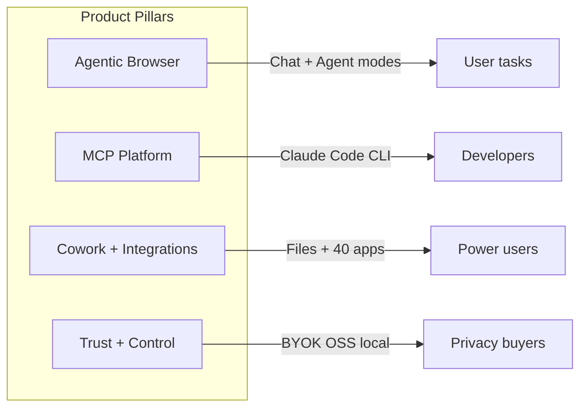
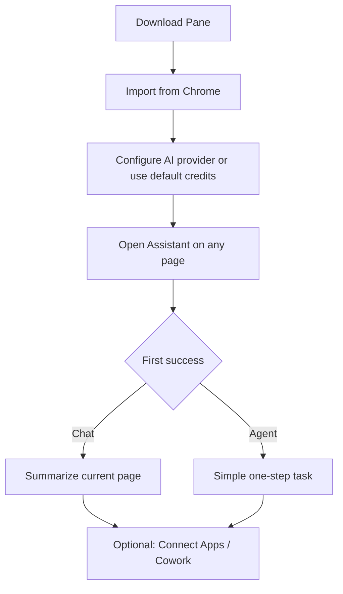

# Pane Product Overview

Pane is an open-source, AI-native browser built on Chromium. Users describe tasks in plain language; the product turns those words into browser actions, file work, and app integrations — locally, with their own models and keys.

This document is the product lens on the Pane workspace: who it serves, what it does, how it is positioned, and how the experience is structured. For implementation detail, see [ARCHITECTURE.md](./ARCHITECTURE.md).

---

## Table of Contents

1. [Vision and Positioning](#vision-and-positioning)
2. [Problem and Opportunity](#problem-and-opportunity)
3. [Target Users](#target-users)
4. [Product Pillars](#product-pillars)
5. [Core Experience Modes](#core-experience-modes)
6. [Feature Catalog](#feature-catalog)
7. [Information Architecture](#information-architecture)
8. [Key User Journeys](#key-user-journeys)
9. [Integrations and Ecosystem](#integrations-and-ecosystem)
10. [Competitive Landscape](#competitive-landscape)
11. [Business Model](#business-model)
12. [Distribution and GTM](#distribution-and-gtm)
13. [Product Principles](#product-principles)
14. [Roadmap Signals](#roadmap-signals)
15. [Success Metrics](#success-metrics)
16. [Related Resources](#related-resources)

---

## Vision and Positioning

**One-line:** Pane is the open-source, AI-native browser that puts the agent *inside* the browser — where your work already lives — so it can act on your tabs, files, and terminal in one loop, locally, with your own models. No Pane servers, no account, no vendor lock-in.

**Category:** Agentic browser (Chromium fork + native agent + MCP server).

**Origin:** Pane is a fork of [BrowserOS](https://github.com/browseros-ai/BrowserOS) — an excellent open-source agentic-browser project. We forked to pursue a different product trajectory: agent-native, local-first, and server-free, building the "agent that lives in your browser" vision on top of a solid foundation.

**Differentiators:**

| Dimension | Pane stance |
|-----------|------------------|
| **Agent placement** | The agent lives *in* the browser — same session, tabs, logins; not a sidebar or a remote-driven browser |
| **Scope** | Web + files + terminal in one agent loop (Cowork), not browser-only |
| **Privacy** | Local-first; BYOK or local models (Ollama, LM Studio); data stays on device |
| **Openness** | AGPL-3.0; inspectable code; no vendor lock-in on model or integrations |
| **Developer surface** | The browser *is* the MCP server; one URL for Claude Code, Cursor, Gemini CLI, `browseros-cli` |
| **Servers** | None. No Pane account, cloud, credits, or metering — by design |
| **Chrome compatibility** | Extensions, import, familiar UX; MV2 support for full uBlock Origin |

**Created by:** [Abhishek Verma](https://www.linkedin.com/in/abhi-vrma/) ([GitHub](http://github.com/abhishek-verma/) · [X](https://x.com/vrma_abhi)). Community on Discord.

---

## Problem and Opportunity

### Problems users face

1. **AI assistants live outside the browser.** Users copy URLs, screenshots, and page text into ChatGPT or Claude. Context is lost; workflows break.
2. **Closed AI browsers lock you in.** Proprietary assistants, single providers, opaque data handling.
3. **Automation is fragmented.** Selenium scripts, browser extensions, and separate MCP servers do not share one session with the user's logins.
4. **Cowork-style agents lack the web.** File-only agents (e.g. Claude Cowork in a VM) cannot click, scrape, or use authenticated web apps in the user's real session.
5. **Developers repeat manual browser QA.** Frontend devs switch between terminal, browser, and IDE to reproduce and fix UI bugs.

### Opportunity

Put the agent **inside** the browser the user already uses for work: same cookies, tabs, and extensions — plus MCP so external coding agents share that context. Combine web automation, local files (Cowork), and 40+ app connectors in one product.

---

## Target Users

### Primary personas

| Persona | Job to be done | Why Pane |
|---------|----------------|---------------|
| **Knowledge worker** | Research, summarize, fill forms, extract data from the web | Agent mode + chat with page context; scheduled tasks for repeat work |
| **Power browser user** | Many tabs, ad blocking, vertical tabs | Chromium + uBlock MV2 + vertical tabs |
| **Developer / IC engineer** | Test localhost, debug UI, automate flows from Claude Code | MCP server, agentic coding loop, CLI |
| **Automation-minded user** | "Run this every morning" | Scheduled tasks + smart schedule nudges |
| **Privacy-conscious user** | AI without sending browsing to a black box | BYOK, local models, open source |

### Secondary personas

| Persona | Job to be done |
|---------|----------------|
| **Existing subscription holder** | Use ChatGPT Pro, GitHub Copilot, or similar OAuth without extra API spend |
| **Ops / growth** | Connect Slack, Linear, Notion, Salesforce via MCP |
| **Evaluator / buyer** | Compare vs Atlas, Comet, OpenClaw, Chrome DevTools MCP |

### Anti-personas (poor fit today)

- Users who want **only** messaging-app AI (WhatsApp/Telegram bot) → OpenClaw-style products fit better.
- Users who need **production-grade Office output** (Excel formulas, PowerPoint) → Claude Cowork's VM doc stack is stronger.
- Users who want **zero setup and zero model config** with unlimited cloud AI → closed products may feel simpler (Pane still offers limited default credits).

---

## Product Pillars

Four pillars define the product strategy:



1. **Agentic browser** — Natural language → clicks, navigation, extraction, multi-tab work.
2. **MCP platform** — Pane as a server others connect to; symmetric with built-in assistant.
3. **Cowork + integrations** — Filesystem sandbox + Klavis-managed app MCPs + smart connection nudges.
4. **Trust + control** — Open source, provider choice, optional cloud sync, local session storage.

---

## Core Experience Modes

Documented in public docs as three modes (third is roadmap):

| Mode | User intent | Model requirements | Status |
|------|-------------|-------------------|--------|
| **Chat** | Ask about current page; summarize, translate, extract | Any model; local LLMs OK | GA |
| **Agent** | Multi-step automation; forms, navigation, tools | Strong reasoning (Claude Opus/Sonnet recommended) | GA |
| **Graph** | Visual, repeatable workflows | TBD | **Coming soon** (docs index) |

### Chat vs Agent (product guidance)

- **Chat:** Low friction, page-grounded Q&A. Side panel or new tab chat; attach tabs as context.
- **Agent:** Tool loop with visible MCP batches, glow on active tab, Cowork folder optional. Higher failure cost → recommend top-tier cloud models.
- **Harness agents (alpha):** Claude Code and Codex as first-class targets in provider picker (`AGENT_HARNESS_SUPPORT`) for users who want subscription-backed coding agents inside the browser UI.

---

## Feature Catalog

Features grouped by user outcome. Maturity reflects docs, UI routes, and changelog unless noted.

### Automation and intelligence

| Feature | Outcome | Notes |
|---------|---------|-------|
| **Built-in AI agent** | Execute tasks via natural language | 53+ tools; multi-tab; session resume in assistant |
| **Side panel assistant** | Persistent chat/agent while browsing | Toolbar toggle; Agent vs Chat modes |
| **New tab / Home** | Unified search, top sites, agent command center | Redesigned in v0.46; `/home` routes |
| **Agent Command** | Dedicated command center for agent conversations | `/home/agents/:id` |
| **Scheduled tasks** | Autopilot on daily / hourly / minute intervals | Sidebar + nudge from chat |
| **Smart nudges** | Connect app or schedule task at the right moment | Interactive cards in conversation |
| **Graph workflows** | Repeatable visual automations | Announced; not shipped |

### Files and cross-surface work

| Feature | Outcome | Notes |
|---------|---------|-------|
| **Cowork** | Browser + sandboxed folder (read/write/bash/search) | 7 filesystem tools; folder picker in composer |
| **Parallel subtasks (Cowork)** | Break work across sub-agents | Docs: "Coming soon" vs Claude Cowork |

### Connectivity

| Feature | Outcome | Notes |
|---------|---------|-------|
| **Connect Apps** | 40+ OAuth/API integrations (Gmail, Slack, GitHub, …) | Klavis-backed; `/connect-apps` |
| **Pane as MCP** | Expose browser to external MCP clients | Settings → copy URL; `browseros-cli init` |
| **Custom MCP servers** | User-added MCP endpoints | Connect Apps + MCP settings |
| **n8n integration** | Workflow automation via docs recipe | Integration doc |

### Models and providers

| Feature | Outcome | Notes |
|---------|---------|-------|
| **Bring your own LLM** | API keys for major cloud providers | Settings → AI & Agents |
| **OAuth providers** | ChatGPT Pro/Plus, GitHub Copilot | No extra API key |
| **Local models** | Ollama, LM Studio | Strong for chat; weak for agent today |
| **Default model (Kimi K2.5)** | Try before BYOK | Partnership; limited daily credits for testing |
| **Chat & Council Provider** | Split-view / LLM Hub providers | Separate from agent provider |
| **Remote Hermes** | Additional agent provider (gated) | `HERMES_AGENT_SUPPORT` |

### Browser and UX

| Feature | Outcome | Notes |
|---------|---------|-------|
| **Vertical tabs** | Side panel tab strip | Default on; toggle in customization |
| **Split-view / LLM Hub** | ChatGPT, Claude, Gemini beside page | Alt+K; Cmd+Shift+U for council |
| **Ad blocking (MV2)** | Full uBlock Origin | ~10x vs stock Chrome in public benchmark |
| **Chrome import** | Bookmarks, passwords, extensions | Onboarding step 1 |
| **Glow indicator** | Visual feedback when agent works a tab | Orange viewport pulse |
| **Voice input** | Speak prompts | Shipped v0.44 |

### Account and sync

| Feature | Outcome | Notes |
|---------|---------|-------|
| **Cloud sync** | Conversations, settings, scheduled tasks across devices | Magic link or Google; GraphQL API |
| **Usage & billing** | Credits display and billing | Gated by `CREDITS_SUPPORT`; `/settings/usage` |

### Developer

| Feature | Outcome | Notes |
|---------|---------|-------|
| **Agentic coding** | Claude Code ↔ Pane test/fix loop | Primary dev GTM story |
| **browseros-cli** | Terminal control + MCP | curl install script; npm shim |
| **Use with Claude Code** | One-line MCP add | Public doc + onboarding video |

### Pulled back / returning (changelog)

v0.46 **streamlined** Skills, Soul, and Memory to refocus — docs redirects send old URLs to home. Expect revised versions later. Do not treat as current GA surface in sales or support.

---

## Information Architecture

### Primary navigation (extension app)

Sidebar (`SidebarNavigation.tsx`):

| Nav item | Route | Purpose |
|----------|-------|---------|
| **Home** | `/home` | New tab: search, agent command, personalize |
| **Connect Apps** | `/connect-apps` | Integration catalog and auth |
| **Scheduled Tasks** | `/scheduled` | CRUD for automations |
| **Settings** | `/settings/ai` | Deep settings (separate layout) |

### Settings structure

| Section | Route | Purpose |
|---------|-------|---------|
| AI & Agents | `/settings/ai` | LLM providers, default model, harness agents |
| Chat & Council Provider | `/settings/chat` | Split-view / hub models |
| Customize Pane | `/settings/customization` | Vertical tabs, themes, UX prefs |
| Pane as MCP | `/settings/mcp` | MCP URL, external client setup |
| Usage & Billing | `/settings/usage` | Credits (when enabled) |

### Other surfaces

| Surface | Entry | Purpose |
|---------|-------|---------|
| **Side panel** | Browser toolbar | Main chat/agent loop while browsing |
| **Onboarding** | First install | Import, provider setup, feature tour |
| **Profile / auth** | `/login`, `/profile` | Cloud account |

### Mental model for users

```
Browse (Chromium) ──► Ask (side panel / new tab)
                   ──► Automate (agent + tools + optional Cowork folder)
                   ──► Connect (apps + MCP)
                   ──► Repeat (scheduled tasks)
                   ──► Extend (Claude Code, CLI, custom MCP)
```

---

## Key User Journeys

### Activation (first session)



**Time-to-value target:** Under 5 minutes (docs promise ~2 minutes for setup). Critical path: import → provider → one successful assistant interaction.

**Friction points to monitor:**

- CDP/server connection errors (troubleshooting doc exists)
- Agent mode with weak local models (set expectations in onboarding)
- OAuth vs API key confusion for providers

### Core loop: agent task

1. User opens side panel or home composer.
2. Selects **Agent mode** and provider (optional Cowork folder).
3. Describes task; attaches tabs if needed.
4. Agent streams response; tool batches visible; tab glows during work.
5. Smart nudge may offer app connect or schedule.
6. Session persists; user can resume from history.

### Power loop: developer MCP

1. User copies MCP URL from settings.
2. Runs `claude mcp add` or `browseros-cli init`.
3. From Claude Code: "Open localhost:3000, click Sign up, read console errors, fix the bug."
4. Same browser session as manual browsing (authenticated pages work).

### Retention loop: scheduled task

1. User completes valuable repeatable task in agent.
2. Schedule nudge or explicit "run this daily."
3. Task runs headless on interval; user reviews results in history.

---

## Integrations and Ecosystem

### Integration layers

| Layer | What it connects | User-facing name |
|-------|------------------|------------------|
| **Built-in app MCPs** | 40+ SaaS apps via Klavis | Connect Apps |
| **Pane MCP server** | Browser control for any MCP client | Pane as MCP |
| **User custom MCP** | Self-hosted or third-party servers | Custom MCP in Connect Apps |
| **Cloud API** | Account, sync, credits, GraphQL | Sign in / api.browseros.com |
| **Automation platforms** | n8n recipes | Docs integration |

### MCP as strategic wedge

Pane is both **consumer** (Connect Apps) and **provider** (browser tools). That symmetry is the developer GTM: the same automation surface powers in-browser agent and Claude Code.

**Tool count messaging:** Public materials cite 53+ tools (browser + filesystem + utilities). Onboarding feature copy sometimes says 31 browser tools — align externally on the broader number unless scoped to browser-only.

---

## Competitive Landscape

### Positioning matrix

| Competitor | Pane wins on | Competitor wins on |
|------------|-------------------|---------------------|
| **ChatGPT Atlas / Comet / Dia** | Open source, BYOK, MCP, Cowork, scheduled tasks, ad blocking | Polish, single-vendor simplicity, may bundle unlimited AI |
| **Chrome + DevTools MCP** | No debug profile; works out of box; full session | DevTools depth for Chrome-only debugging |
| **Claude Cowork** | Real browser, 40+ apps, any LLM, free + BYOK | Rich document generation in VM |
| **OpenClaw** | Zero terminal setup; in-browser UX | Messaging channels, always-on daemon, mobile companions |

Detailed comparisons live in public docs: `docs/comparisons/`.

### Strategic narrative

Pane is **not** "another chat sidebar." It is:

1. A **browser replacement** for Chrome power users who want AI and privacy patches.
2. An **automation runtime** with MCP as the integration standard.
3. A **cowork surface** that adds the web to file-agent workflows.

---

## Business Model

Inferred from product behavior and docs (not a financial forecast).

| Layer | Model |
|-------|--------|
| **Browser download** | Free, open source |
| **Default AI** | Kimi K2.5 (or similar) with **limited daily credits** for trial |
| **Full usage** | BYOK (user pays provider) or OAuth subscriptions (ChatGPT Pro, Copilot) |
| **Cloud sync / account** | Free sign-in; drives retention and cross-device stickiness |
| **Credits / billing** | Usage page when `CREDITS_SUPPORT` enabled — likely monetization path for hosted inference |
| **Enterprise** | Not prominently documented in repo; likely sales-led separately |

**Pricing philosophy (product):** Avoid forcing a single AI vendor. Revenue likely mixes hosted credits, partnerships (e.g. Kimi default), and future team features — while keeping the OSS core and BYOK path credible.

---

## Distribution and GTM

### Channels

| Channel | Role |
|---------|------|
| **browseros.com / files CDN** | Direct DMG, EXE, AppImage, deb downloads |
| **GitHub** | Source, issues, feature requests (#99), releases |
| **Docs + llms.txt** | SEO, LLM discoverability, self-serve setup |
| **Discord / Slack / X** | Community support and feedback |
| **Developer content** | Claude Code demos, CLI install script, MCP comparisons |
| **Eval viewer / benchmarks** | Credibility for agent quality (weekly CI eval) |

### Release motion

Tagged releases for server, extension, CLI; nightly Chromium builds. Changelog is user-facing product communication (v0.46 harness agents, MCP rebuild, UI redesign).

### Onboarding content

In-app: `/onboarding`, `/onboarding/features` (bento grid with videos). External: docs onboarding + feature pages with demo videos on R2 CDN.

---

## Product Principles

Derived from positioning, docs tone, and feature tradeoffs:

1. **Local-first by default.** Cloud is opt-in for sync, not required to automate.
2. **Bring your own brain.** Never block users on one LLM vendor.
3. **Meet users in the browser.** No separate daemon or chat app required for core value.
4. **Show the work.** Tool batches, glow, snapshots — agent actions should be visible and debuggable.
5. **Suggest, don't nag.** Smart nudges offer connect or schedule; user can decline permanently.
6. **Open beats opaque.** AGPL and MCP align with developer trust.
7. **Ship focused surfaces.** Willing to pull back features (Skills, Soul, Memory) to rebuild them well.

---

## Roadmap Signals

From changelog, docs, and codebase — not a committed roadmap.

| Signal | Evidence | Implication |
|--------|----------|-------------|
| **Graph mode** | Docs index "Coming soon" | Visual workflow builder; third core mode |
| **Skills / Memory / Soul return** | v0.46 pulled back; redirects in docs | Personalization and reusable instructions v2 |
| **Harness agents in UI** | v0.46 Claude Code & Codex in browser | Blur line between coding agent and browser agent |
| **Cowork parallel subtasks** | Comparison doc "Coming soon" | Parity with Claude Cowork orchestration |
| **Credits / billing** | `CREDITS_SUPPORT`, usage page | Hosted inference or metering productization |
| **BrowserClaw stack** | `claw-server`, `claw-app` in monorepo | Possible separate or experimental product surface (governance, replay) — not in main user docs |

---

## Success Metrics

Suggested KPIs a PM would track (not all may be instrumented publicly).

### Activation

- Download → first assistant message (chat or agent)
- Provider configured (BYOK or OAuth) within 7 days
- Chrome import completed

### Engagement

- Weekly active assistant users (side panel + home)
- Agent mode sessions vs chat-only ratio
- Tool calls per agent session
- Cowork folder attached rate
- Connect Apps: integrations per user

### Retention

- D7 / D30 return to browser with assistant use
- Scheduled tasks created and still enabled
- Cloud sign-in and multi-device sync adoption

### Developer

- MCP URL copies / `browseros-cli init` success
- Claude Code MCP add completions (if measurable)
- GitHub stars, Discord/Slack joins

### Quality

- Agent task completion rate (eval harness: WebVoyager, Mind2Web, AGI SDK)
- Connection error rate (`/health`, troubleshooting doc traffic)
- Credit exhaustion → BYOK conversion

### Business

- Credit consumption and upgrade on usage page
- OAuth provider attach rate (ChatGPT Pro, Copilot)

Instrumentation hints: PostHog in server and app, Sentry for errors, server `/credits` endpoint, analytics event constants in `apps/app/lib/constants/analyticsEvents.ts`.

---

## Related Resources

| Resource | Location |
|----------|----------|
| Technical architecture | [ARCHITECTURE.md](./ARCHITECTURE.md) |
| Public documentation | [docs.browseros.com](https://docs.browseros.com) |
| Mintlify source | `docs/` |
| Feature marketing copy | `packages/browseros-agent/apps/app/screens/onboarding/features/Features.tsx` |
| App routes (IA) | `packages/browseros-agent/apps/app/entrypoints/app/App.tsx` |
| Feature flags | `packages/browseros-agent/apps/app/lib/browseros/capabilities.ts` |
| Changelog | `docs/changelog.mdx` |
| Comparisons | `docs/comparisons/` |
| Contributing | [CONTRIBUTING.md](./CONTRIBUTING.md) |

---

*This document reflects the product as represented in the Pane repository and public docs. For sales or support, verify feature availability against the user's Pane version and enabled capability flags.*
