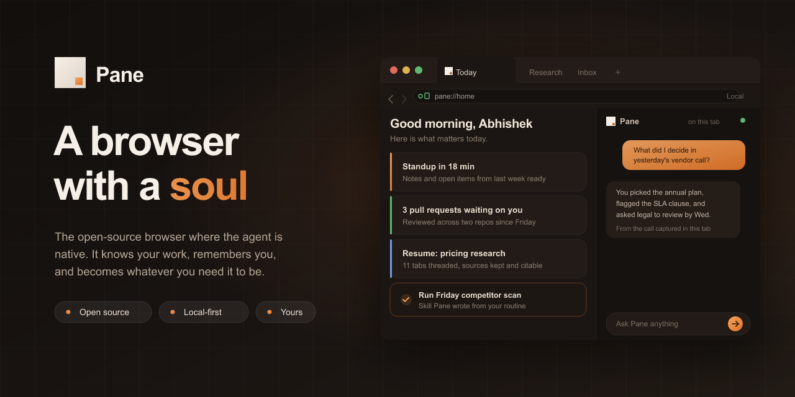

  

  
  

  Created by <strong>Abhishek Verma</strong> 
  <a href="https://www.linkedin.com/in/abhi-vrma/">LinkedIn</a> ·
  <a href="http://github.com/abhishek-verma/">GitHub</a> ·
  <a href="https://x.com/vrma_abhi">X</a>

Most of your work already happens in a browser. Tabs, logins, docs, dashboards, tickets, research, meetings. But the AI that is supposed to help you still lives somewhere else — in a chat tab, a desktop app, or a daemon you have to wire up yourself. You stop, copy context over, explain what you were doing, and hope it understands.

**Pane is a browser with a soul** — an open-source Chromium fork where the agent is native to your session, learns from how you work, and becomes whatever you need it to be.

Not a sidebar glued onto Chrome. Not a remote agent driving your browser from the outside. Not the same chatbot for every user. Pane sees your real tabs, remembers your patterns, reaches your files and terminal, and grows more personal over time. All on your machine. No Pane account. No Pane cloud.

## A browser that becomes yours

Most software treats everyone the same. Pane is built to take a shape that fits *your* life:

- **Chief of staff** if you are building a company — morning briefings, meetings captured and summarized, follow-ups tracked, investor updates drafted from the week you actually lived in tabs.
- **Job search partner** if you are looking for what's next — fit scores on listings against your background, applications organized, company research threaded, interview prep from pages you already read.
- **Research and study buddy** if you are learning — papers and threads that do not evaporate when you close a tab, citations back to sources, outlines from a week of browsing toward one question.
- **Whatever else you need** — because Pane learns your workflows, writes skills when you repeat them, and scopes memory into buckets so work, job hunt, and personal life do not bleed into each other.

The soul is not a gimmick. It is memory, capture, and context that compound — a browser that knows you well enough to stop feeling like generic software.

> **[Documentation](https://github.com/abhishek-verma/Pane/tree/main/docs)** · **[GitHub](https://github.com/abhishek-verma/Pane)** · **[Feature requests](https://github.com/abhishek-verma/Pane/issues)**

## The problem Pane is solving

Personal agents like Hermes and OpenClaw are the real thing — persistent memory, self-written skills, scheduled work, files and terminal, reach on other channels. But they attach to your browser from the outside through plugins, CDP, or automation. They get a snapshot of your work, not the situation.

AI browsers like Atlas, Comet, and Dia put AI inside the browser — but they are still mostly **chatbots with page context**. Summarize this tab. Answer a question. Maybe run a short task. They do not give you a personal agent that remembers you, writes skills from your workflows, runs work on a schedule, or compounds over time the way Hermes does.

**Pane is trying to combine both.** Everything a Hermes-style agent does — but native to the browser, with better context, on your machine, open source.

## What that makes possible

Because the agent lives inside the browser — not beside it — Pane can do things bolt-on tools structurally cannot:

**It can know what you are working on.** Not just the current page, but the thread of tabs, files, terminal commands, and tasks that belong to one project. Pane is building a local context graph for this: your work, indexed on your machine, scoped into buckets so work does not leak into personal life.

**It can remember you and improve itself.** Memory that is grounded in real browsing and real workflows, not self-reported facts. Skills that Pane writes when it sees you repeat something successfully — then prunes when they go stale. The goal is a browser that gets more useful every week you use it.

**It can capture what you would otherwise lose.** Meetings run in tabs — Pane can record and transcribe them locally, without a bot joining your call. Research is a chain of pages — Pane can thread that chain and help you cite it later. Today you stitch this together with Otter, Granola, tab groups, and notes apps. Pane wants it in one place, because it already is the browser.

**It can act on your machine, safely.** Files, terminal, outbound actions — all with previews, approvals, and a replayable log. The agent should help you work, not surprise you.

**It can reach you when you are away.** Scheduled and triggered runs, a daily digest of what matters, notifications and email when something needs your attention. Peer-to-peer, not through a Pane server.

Some of this is live today. Some is what we are building toward. The point is the direction: **a browser that understands your work and acts on your behalf**, not another chat box you paste into.

## A glimpse of what's possible

When the browser has a soul — memory, context, and the ability to change itself — it stops feeling like software you configure and starts feeling like something that knows you. A few examples of where Pane is headed:

**A new tab that knows your day.** Not the same static homepage for everyone. Open a tab in the morning and see what actually matters: the meeting in twenty minutes with notes from last time, the three PRs still waiting, the research thread you left off yesterday, one-click actions for the report you run every Friday. The homepage evolves because Pane learns your rhythms — widgets, digests, and shortcuts that rearrange themselves as your work changes.

**Pages reshaped for you.** Pane can read a page in the context of *your* goals and rewrite how it appears. A job listing shows a fit score against your resume and skills — not a generic "AI summary," but *your* match probability, pulled from the workspace you granted. A flight search highlights the routes that fit your calendar. A long policy doc gets margin notes tied to the project you are working on. The web stays the web; Pane layers what you need on top of it.

**Feeds without the slop.** LinkedIn, but the engagement bait and recruiter spam fade out and the people you actually learn from stay. The same idea on X, Hacker News, or any feed you live in: Pane learns what you consider noise versus signal, and quietly hides the rest. You did not come to the internet to scroll past slop. The browser can help.

**Meetings that remember themselves.** Your standup runs in a tab. Pane captured last week's call locally — who said what, what was decided, what's still open. When you join again, the context is already there. No Otter bot. No separate notes app. The meeting lived in the browser; the browser kept the memory.

**Research that survives the tab close.** You spent four days chasing a question across papers, docs, and forum threads. Pane threaded that journey into a research bucket — pages in order, key quotes preserved, sources citable. Next week you ask for a draft outline and every claim links back to the tab it came from.

**Work that runs itself — with your approval.** Pane notices you do the same competitor scan every Monday. It writes a skill from the workflow. Next Monday it offers to run it. You approve once. It becomes part of how you work, not a cron job you maintain by hand.

**Shopping and decisions across sessions.** You compared laptops on three sites over two days but never booked. Pane remembers the candidates, the tradeoffs you cared about, and surfaces a comparison when you are ready — because it was watching the *work*, not just the last page.

**Your localhost, in context.** You are debugging a feature. Open a new tab on `localhost:3000` and Pane already knows the ticket, the branch, the last failing test — because the browser session, your workspace, and your terminal are one loop, not three apps you sync by hand.

These are not chatbot tricks. They are what becomes possible when the agent is the browser, has memory, captures your activity with consent, and can act on pages and files on your behalf. Most of this is still ahead of us. The foundation to build it is what we are shipping now.

## What you can use today

Pane is early. The full vision is a multi-phase build ([see the plan](specs/IMPLEMENTATION-PLAN.md)). What ships now is the foundation — enough to be useful, honest about what is still coming.

**For developers:** Pane is your real browser as an MCP server. Point Claude Code or Cursor at it, and your coding agent drives the same session you use — localhost, logged-in apps, console errors, the lot. One URL, no fake WebDriver session. Pair that with a local workspace folder and terminal access, and you have browser + repo + shell in one loop.

**For everyone:** Chat with the page you are on. Ask Pane to automate a multi-step web task in your real session. Save output to a folder on disk. Schedule something to run again. Bring your own model — API key, OAuth subscription, or Ollama on your machine.

That is the wedge: prove the agent-in-the-browser thesis works, then layer on memory, capture, and proactive work.

## Why Pane is not BrowserOS

Pane is a fork of [BrowserOS](https://github.com/browseros-ai/BrowserOS), and BrowserOS is a genuinely good project — if you want their vision, you should use it.

We forked because we wanted a different product trajectory:

|                       | BrowserOS                                                       | Pane                                                                    |
| --------------------- | --------------------------------------------------------------- | ----------------------------------------------------------------------- |
| **Product shape**     | AI-native browser with cloud sync, credits, and hosted services | Personal agent that *is* the browser — no Pane servers                  |
| **Memory & skills**   | Pulled back in v0.46; rebuilding                                | Core bet: local memory + auto-written skills from your real work        |
| **Capture & context** | Not the focus                                                   | Meeting notes, browsing learnings, context buckets — native to the fork |
| **Trust model**       | Implicit                                                        | Explicit: approvals, dry-run, action log                                |
| **Business model**    | Hosted inference path                                           | BYOK / OAuth / local only; open source first                            |

BrowserOS gave us a Chromium fork, an agent runtime, MCP tools, and a developer wedge. Pane takes that substrate and aims at something more personal: **a browser that becomes yours over time**.

## Try it

1. **Download** — [macOS](https://files.browseros.com/download/BrowserOS.dmg) · [Windows](https://files.browseros.com/download/BrowserOS_installer.exe) · [Linux](https://files.browseros.com/download/BrowserOS.AppImage) · [Debian](https://cdn.browseros.com/download/BrowserOS.deb) *(installers still use BrowserOS artifact names until Pane infra lands)*
2. **Import from Chrome** (optional) — bookmarks, passwords, extensions carry over
3. **Connect a model** — your API key, ChatGPT Pro / Copilot / Qwen via OAuth, or a local model ([setup guide](docs/features/bring-your-own-llm.mdx))
4. **Open the assistant** — toolbar button on any page, or the new-tab home

**Developer quick path:** Settings → Pane as MCP → copy the URL → `claude mcp add pane <url>`. Then from Claude Code: *"open localhost:3000, reproduce the signup bug, read the console, fix it."*

## Built on trust

- **Open source** (AGPL-3.0) — inspect the code, fork it, contribute
- **Local-first** — your browsing, memory, and captures stay on your machine
- **Your models** — no required vendor, no Pane account, no metering
- **No Pane servers** — the product is complete without us running infrastructure for you

## Contributing

Pane is early and moving fast. [Report bugs](https://github.com/abhishek-verma/Pane/issues), [suggest features](https://github.com/abhishek-verma/Pane/issues), or read the [contributing guide](CONTRIBUTING.md).

Product specs live in `[specs/](specs/README.md)`. Architecture in `[specs/ARCHITECTURE-DESIGN.md](specs/ARCHITECTURE-DESIGN.md)`.

## Credits

- **[BrowserOS](https://github.com/browseros-ai/BrowserOS)** — Pane's Chromium fork, agent runtime, and MCP substrate. An excellent project; go check it out if Pane's direction is not what you need.
- [ungoogled-chromium](https://github.com/ungoogled-software/ungoogled-chromium) — privacy patches
- [The Chromium Project](https://www.chromium.org/)

## License

Pane is open source under the [AGPL-3.0 license](LICENSE).

Copyright &copy; 2026 Abhishek Verma and Pane contributors.