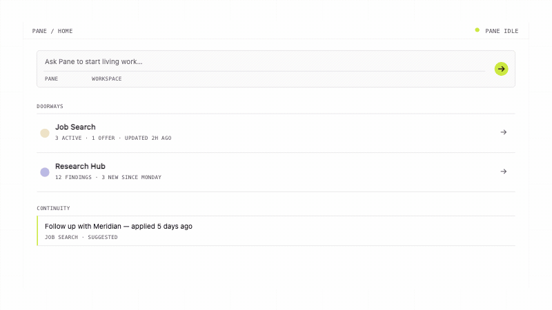
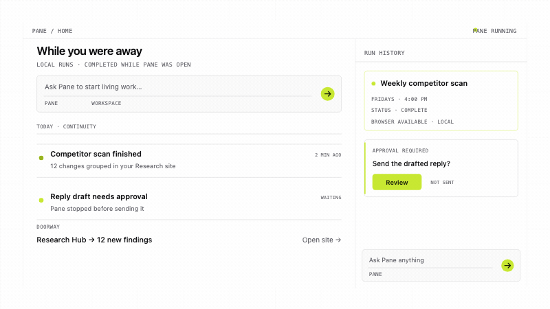
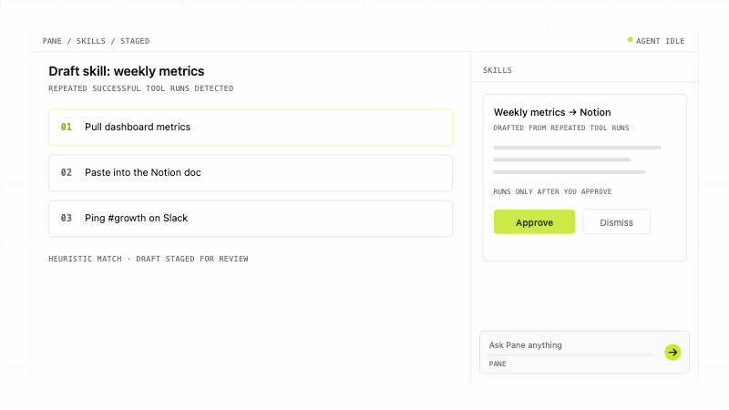

# Pane Browser <sup>α</sup>

> **Early access** — Pane is in active development. Expect rough edges, and please [report bugs](https://github.com/abhishek-verma/Pane/issues).

Created by **Abhishek Verma**  
[LinkedIn](https://www.linkedin.com/in/abhi-vrma/) · [GitHub](http://github.com/abhishek-verma/) · [X](https://x.com/vrma_abhi)

Browsers forget the work behind your tabs. Close a page, leave a meeting, or return the next morning and you reconstruct the thread yourself. Repeated work starts over. Anything beyond the page gets handed back to you.

Browsers are also passive, like an IDE from the pre-AI era. What passes for "modern AI browsers" today is just AI taped onto good ol' Chrome. At best, it saves you a few clicks from opening ChatGPT, filling a form or navigating a few pages.

90% of your work lives in a browser, don't settle for less.

# A browser that keeps work moving when you step away.

**Pane remembers the thread, learns your routines, and gets better as you work.**

Pane is an open-source Chromium browser with a personal agent built into the session you already use. It can connect what happened across pages, meetings, research, files, and terminal; and do the work you were supposed to do, and that's only half the story.

<p align="center">
  
</p>

## Download

<p align="center">
  <a href="https://github.com/abhishek-verma/Pane/releases/latest">
    
  </a>
</p>

> macOS arm64 (Apple Silicon). Click the badge, then download `Pane_v*_arm64.dmg`. [All releases →](https://github.com/abhishek-verma/Pane/releases)

**Homebrew:**

```sh
brew install --cask abhishek-verma/pane/pane
```

**Manual install:**

1. **Download** the DMG above, open it, and drag Pane to Applications ([macOS install guide](docs/install/macos.mdx)).
2. **Import from Chrome** if you want your bookmarks, passwords, history, and extensions.
3. **Connect a model.** OAuth is usually the easiest path if you already pay for Claude, ChatGPT Pro, GitHub Copilot, or Qwen. You can also paste an API key or use a local model ([setup guide](docs/features/bring-your-own-llm.mdx)).
4. **Open Pane** from the toolbar on any page or from the new-tab home.
5. **Enable capture** — meeting capture, research mode, and browsing learnings are off until you opt in.

> **[Documentation](https://github.com/abhishek-verma/Pane/tree/main/docs)** · **[Discord](https://discord.gg/652JHSyS4)** · **[Feature requests](https://github.com/abhishek-verma/Pane/issues)**

## What changes when the agent is the browser

### Personalised Internet: A new way to work and browse

Chats are poor containers for work that lasts days or weeks. Pane creates private, living sites for it instead: a Job Search pipeline, a Research Hub, a Sales Pipeline, or a site shaped around what you are doing. Chatting with an AI is so last year.

<p align="center">
  
</p>

These sites live in your browser profile and get more useful the longer you use Pane.

### What mattered stays

Pane can capture a web meeting locally, keep a multi-day research trail, and search the activity around your work. You can close the tabs and return to the decisions, sources, and unfinished thread later.

<p align="center">
  
</p>

Meeting capture and research mode are opt-in. Recording is visible, domain-specific, and pauseable. Transcription can run on-device after a one-time model download.

### Work moves while you are away

Save a successful task as a schedule and Pane can run it later, surface the result, and ask for approval when an action has consequences.

<p align="center">
  
</p>

### Pane gets better at your work

Pane keeps editable local memory files and a library of skills. Repeating successful workflows can produce staged skill drafts for you to inspect and approve. Ongoing projects become living sites, and the useful parts of prior work can carry into the next task.

<p align="center">
  
</p>

## For developers: one loop from browser to code

Pane can attach a granted workspace to the in-browser agent, combining live pages with files and terminal. It also exposes the browser as an MCP server, so Claude Code, Cursor, Codex, or another MCP client can drive your real session.

### Reproduce, fix, verify

<p align="center">
  
</p>

### Give your coding agent its real browser

<p align="center">
  
</p>

**Quick path:** Settings → Pane as MCP → copy the URL → `claude mcp add pane <url>`. Then ask your coding agent: *"Open localhost:3000, reproduce the signup bug, read the console, fix it, and verify the result."*

## What works today

Early doesn't mean bare-bones. Pane already ships:

- **Chat & Agent** — ask about the current page or run a multi-step browser task in your real session
- **Personalised Internet** — agent-authored private sites with Job Search, Research Hub, and Sales Pipeline templates
- **Meeting capture** — visible in-tab recording with local transcription after a one-time model download
- **Research mode** — opt-in page threading with sources and local retrieval
- **Memory & skills** — editable `SOUL.md`, `USER.md`, and `MEMORY.md`; built-in skills; staged agent-proposed skills
- **Scheduled tasks** — recurring local agent runs while Pane is running
- **Cowork** — browser, files, and terminal inside a folder you grant
- **Pane as MCP** — expose your live browser session to Claude Code, Cursor, and other MCP clients
- **Your models** — API keys, ChatGPT Pro / Copilot / Qwen OAuth, or local models through Ollama and LM Studio

### Honest limits

- Pane does not run browser work while the browser is fully quit or the machine is asleep. Optional keep-alive can start the local agent server, but browser actions still need a browser process.

## Why this needs to be a browser

A sidebar extension can read a page. An external agent can attach through a debug port. Neither owns the whole situation reliably: the authenticated session, tab history, meeting media, local context, scheduled runtime, and permission surface.

Pane pays the cost of being a Chromium fork because the agent needs to be native to the place where the work happens. The result is not merely better page chat. It is continuity across sessions, capture at the source, and one permissioned loop across web and machine.

## What comes next

The direction is larger than the current build:

### A glimpse of the future Personalised Internet

Personalised Internet could go beyond private project sites and toward personal views over the public web.

- **A personal X** that shows only the posts and notifications that matter to you
- **A personal Hacker News** with a useful summary beside every title and stories ranked against your interests
- **A personal LinkedIn** where every person and company has an explainable ICP match score for your current goal
- **A personal YouTube** that turns long videos into the chapters, claims, and clips worth your time
- **A personal GitHub** that summarizes unfamiliar repositories, highlights issues you can help with, and follows the work you depend on
- **A personal shopping layer** that ranks products by your actual constraints, not ad spend, and remembers why you rejected the alternatives

Your agent would assemble private views on top of the web you already use, shaped by your goals, memory, and judgment.

## Built on trust

- **Open source** (AGPL-3.0) — inspect the code, fork it, contribute
- **Local-first** — browsing context, memory, captures, and private sites stay on your machine
- **Your models** — no required model vendor, Pane account, or credits meter
- **Consent off by default** — capture is permissioned, domain-specific, visible, and pauseable
- **Approvals match consequence** — actions that send, spend, or modify ask before they cross the boundary
- **No Pane servers required** — the core product works without infrastructure operated by Pane

## Why Pane forked BrowserOS

Pane builds on [BrowserOS](https://github.com/browseros-ai/BrowserOS), which supplied the Chromium fork, agent runtime, browser tools, Cowork foundation, and MCP surface.

Both projects share a conviction: the agent belongs inside the browser, where it can work with your real session and tools.

Pane's distinct thesis is that browser work should compound across sessions. Meetings become searchable local transcripts. Research becomes a trail you can resume days later. Repeated workflows become inspectable skills. Ongoing projects become living private sites, and the wider web can become a Personalised Internet shaped around your goals.

Pane is building toward a personal agent that carries the thread across days and weeks, turning browser activity into durable memory, reusable capabilities, and personal views of the web.

BrowserOS is an excellent project, and worth checking out on its own.

## Contributing

Pane is early and moving fast. [Report bugs](https://github.com/abhishek-verma/Pane/issues), [suggest features](https://github.com/abhishek-verma/Pane/issues), or read the [contributing guide](CONTRIBUTING.md).

Product specs live in [specs/](specs/README.md). Architecture in [specs/ARCHITECTURE-DESIGN.md](specs/ARCHITECTURE-DESIGN.md).

## Credits

- **[BrowserOS](https://github.com/browseros-ai/BrowserOS)** — Pane's Chromium fork, agent runtime, and MCP substrate. An excellent open-source project worth checking out.
- [ungoogled-chromium](https://github.com/ungoogled-software/ungoogled-chromium) — privacy patches
- [The Chromium Project](https://www.chromium.org/)

## License

Pane is open source under the [AGPL-3.0 license](LICENSE).

Copyright © 2026 Abhishek Verma and Pane contributors.
