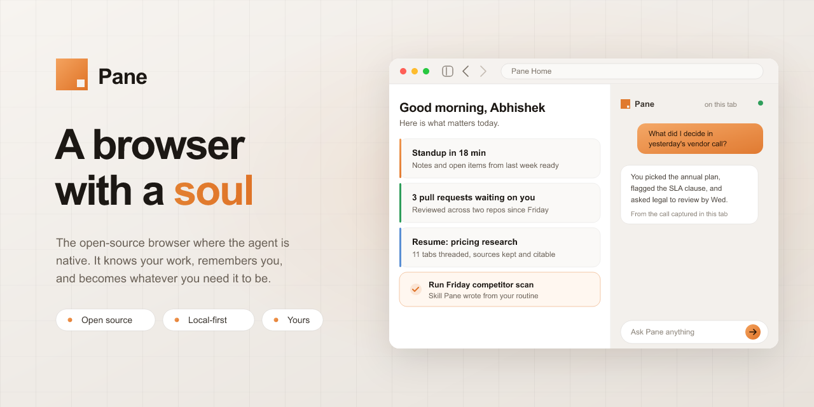
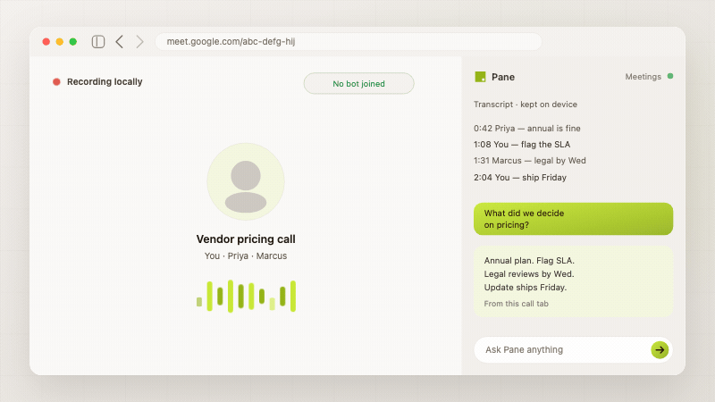
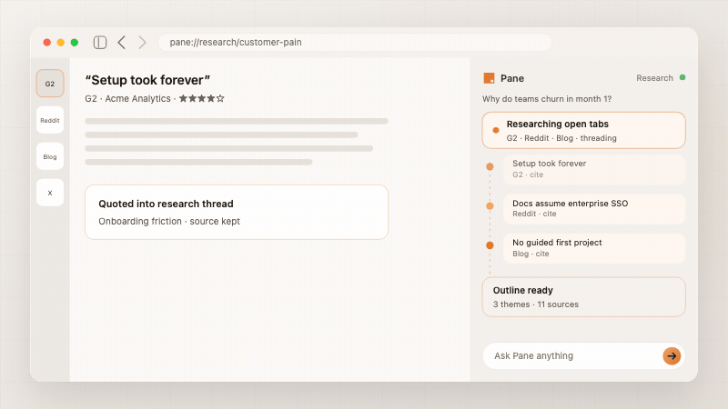
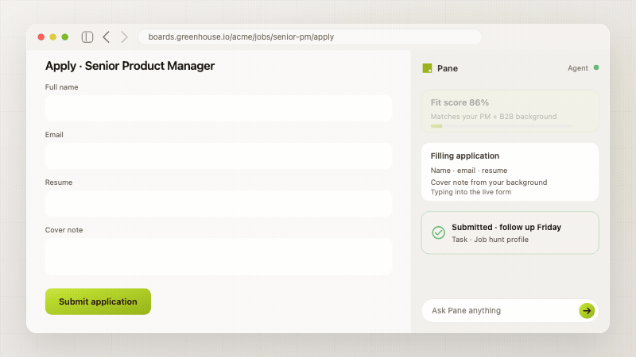
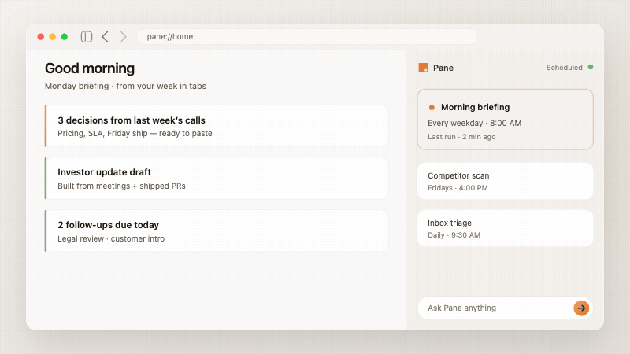
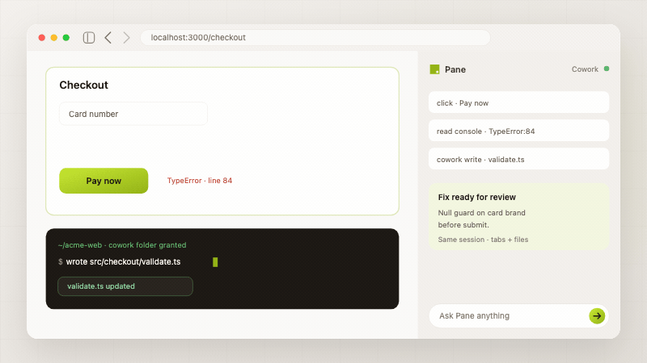
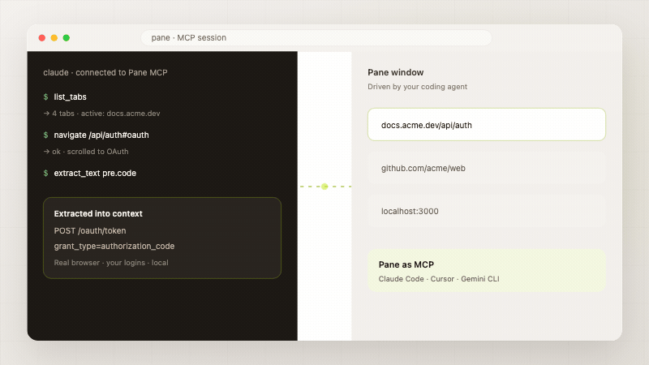

# Pane

Created by **Abhishek Verma**  
[LinkedIn](https://www.linkedin.com/in/abhi-vrma/) · [GitHub](http://github.com/abhishek-verma/) · [X](https://x.com/vrma_abhi)

Most of your work already happens in a browser. Tabs, logins, docs, dashboards, tickets, research, meetings. But the AI that is supposed to help you still lives somewhere else — in a chat tab, a desktop app, or a daemon you have to wire up yourself. You stop, copy context over, explain what you were doing, and hope it understands.

**Pane is a browser with a soul** — an open-source Chromium fork where the agent is native to your session, learns from how you work, and becomes whatever you need it to be.

Not a sidebar glued onto Chrome. Not a remote agent driving your browser from the outside. Not the same chatbot for every user. Pane sees your real tabs, remembers your patterns, reaches your files and terminal, and grows more personal over time. All on your machine. No Pane account. No Pane cloud.

  

## A browser with a soul

The soul is the **combination** that makes Pane yours:

- **Persona** that fits the role you need right now — chief of staff, job-search partner, research buddy — editable and switchable
- **Memory** grounded in what you actually browsed and did, not only what you typed into chat
- **Skills** written when you repeat a workflow successfully, staged for your approval before they run
- **Capture** that stays in the browser — meeting notes without a bot joining the call, research threads that survive the tab close
- **Profiles** so work, job hunt, and personal life do not bleed into each other
- **A home and agent** that get more useful the longer you use Pane

Most software treats everyone the same. Pane is built to take a shape that fits *your* life:

- **Chief of staff** if you are building a company — morning briefings, meetings captured and summarized, follow-ups tracked, investor updates drafted from the week you actually lived in tabs.
- **Job search partner** if you are looking for what's next — fit scores on listings against your background, applications organized, company research threaded, interview prep from pages you already read.
- **Research and study buddy** if you are learning — papers and threads that do not evaporate when you close a tab, citations back to sources, outlines from a week of browsing toward one question.
- **Whatever else you need** — because Pane learns your workflows, writes skills when you repeat them, and scopes memory into profiles.

> **[Documentation](https://github.com/abhishek-verma/Pane/tree/main/docs)** · **[GitHub](https://github.com/abhishek-verma/Pane)** · **[Discord](https://discord.gg/652JHSyS4)** · **[Feature requests](https://github.com/abhishek-verma/Pane/issues)**

## Pane in someone’s week

These are not feature screenshots of chrome. They are moments Pane is built for — a founder on a call, a marketer mid-research, a developer fixing a bug in the same session.

### Meeting notes without a bot

You’re already on Meet, Zoom, or Teams in a tab. Pane records and transcribes locally — no Otter bot joining the call. Ask later what you decided.

  

### Research that survives the tab close

A marketer opens reviews, competitor pages, and threads toward one question. Pane keeps the chain — quotes, sources, and an outline you can cite back to the tabs.

  

### Apply without the copy-paste grind

A listing is open. Pane scores fit against your background, fills the application from your resume, submits it, and files the follow-up.

  

### A homepage that knows your Monday

Before standup, a scheduled run drops a briefing on your home — decisions from last week’s calls, open follow-ups, drafts ready to paste.

  

### Fix the bug in the same session

Localhost is broken. Pane clicks through the UI, reads the console, and writes the fix in the folder you granted — browser and files in one loop.

  

### Your coding agent’s real browser

Point Claude Code or Cursor at Pane over MCP. Same tabs, same logins, same console — not a headless toy session.

  

## The problem Pane is solving

Personal agents like Hermes and OpenClaw are the real thing — persistent memory, self-written skills, scheduled work, files and terminal, reach on other channels. But they attach to your browser from the outside through plugins, CDP, or automation. They get a snapshot of your work, not the situation.

AI browsers like Atlas, Comet, and Dia put AI inside the browser — but they are still mostly **chatbots with page context**. Summarize this tab. Answer a question. Maybe run a short task. They do not give you a personal agent that remembers you, writes skills from your workflows, runs work on a schedule, or compounds over time the way Hermes does.

**Pane is trying to combine both.** Everything a Hermes-style agent does — but native to the browser, with better context, on your machine, open source.

### What that makes possible

Because the agent lives inside the browser — not beside it — Pane can do things bolt-on tools structurally cannot:

**It can know what you are working on.** Not just the current page, but the thread of tabs, files, terminal commands, and tasks that belong to one project. A local context graph indexes that work on your machine, scoped into profiles so work does not leak into personal life.

**It can remember you and improve itself.** With consent, Pane learns from real browsing, files, and terminal activity. Facts land in plain local memory. Repeated workflows become staged skills you approve — then prune when they go stale. The loop runs on your machine.

**It can capture what you would otherwise lose.** Meet, Zoom, or Teams already run in a tab — Pane records and transcribes locally, no Otter bot joining the call. Research threads pages toward a question with quotes, sources, and citations back to the tabs. Today people stitch this with Otter, Granola, tab groups, and notes apps. Pane folds it into the browser, because it already is the browser.

**It can make the homepage yours.** New tab is not a static link grid. Widgets for tasks, captures, skills, and digests — including ones Pane proposes from how you work. Stale ones demote themselves.

**It can act on your machine, safely.** Files, terminal, outbound actions — all with previews, approvals, and a replayable log. The agent should help you work, not surprise you.

**It can reach you when you are away.** Scheduled and triggered runs, a daily digest of what matters, notifications when something needs your attention. Peer-to-peer, not through a Pane server.

## What you can use today

Pane ships the soul stack and the developer wedge. The full vision is still deepening ([see the plan](specs/IMPLEMENTATION-PLAN.md)) — page reshape, richer proactive reach, and more — but the foundation is real.

### The soul stack (Pane-only)

- **Meeting capture** — in-tab recording + local transcription
- **Research threads** — quotes, sources, outlines that survive the tab close
- **Memory & skills** — activity-grounded memory; staged skills you approve
- **Adaptive home** — widgets for tasks, captures, digests, scheduled runs
- **Profiles** — Work / Job hunt / Personal stay separately scoped

### The foundation

- **Chat & Agent** — page-grounded chat and multi-step automation in your session
- **Cowork** — grant a folder; web + files + terminal in one loop
- **Pane as MCP** — Claude Code / Cursor drive your real browser
- **Scheduled tasks** — local schedules, same agent, no Pane cloud cron
- **Your models** — API key, ChatGPT Pro / Copilot / Qwen OAuth, or Ollama

**Developer quick path:** Settings → Pane as MCP → copy the URL → `claude mcp add pane <url>`. Then from Claude Code: *"open localhost:3000, reproduce the signup bug, read the console, fix it."*

## A glimpse of what's next

When the browser has a soul — memory, context, and the ability to change itself — more becomes possible. Some of this is live; some is still ahead:

**Pages reshaped for you.** A job listing shows *your* fit score against your background — not a generic AI summary. A long doc gets margin notes tied to the project you are on. The web stays the web; Pane layers what you need on top.

**Feeds without the slop.** LinkedIn, X, Hacker News — engagement bait fades, the people you learn from stay. Pane learns your signal versus noise.

**Work that runs itself — with your approval.** Pane notices the competitor scan you run every Monday, writes a skill, offers to run it next week. You approve once.

**Decisions across sessions.** You compared laptops on three sites over two days. Pane remembers the candidates and the tradeoffs you cared about when you are ready.

These are not chatbot tricks. They are what becomes possible when the agent is the browser, has memory, captures with consent, and can act on pages and files on your behalf.

## Why Pane is not BrowserOS

Pane is a fork of [BrowserOS](https://github.com/browseros-ai/BrowserOS), and BrowserOS is a genuinely good project — try it if that direction fits you better.

We forked for a different product trajectory: a **personal agent that *is* the browser**, not the other way around.

BrowserOS gave us a Chromium fork, an agent runtime, MCP tools, and a developer wedge. Pane takes that substrate and builds what BrowserOS did not aim at: continuous learning from your activity, native meeting and research capture, memory and skills that compound locally, an adaptive home, and **no Pane-operated cloud** for core features (sync, hosted inference, and credits from upstream are off in Pane builds).

## Try it

1. **Download** — grab the latest build from [GitHub Releases](https://github.com/abhishek-verma/Pane/releases) ([macOS install guide](docs/install/macos.mdx))
2. **Import from Chrome** (optional) — bookmarks, passwords, extensions carry over
3. **Connect a model** — your API key, ChatGPT Pro / Copilot / Qwen via OAuth, or a local model ([setup guide](docs/features/bring-your-own-llm.mdx))
4. **Open the assistant** — toolbar button on any page, or the new-tab home
5. **Turn on capture when you want it** — meeting domains and browsing learnings are off by default; opt in from permissions

## Built on trust

- **Open source** (AGPL-3.0) — inspect the code, fork it, contribute
- **Local-first** — your browsing, memory, and captures stay on your machine
- **Your models** — no required vendor, no Pane account, no metering
- **Consent off by default** — capture and learnings are permissioned, per-domain, pauseable
- **No Pane servers** — the product is complete without us running infrastructure for you

## Contributing

Pane is early and moving fast. [Report bugs](https://github.com/abhishek-verma/Pane/issues), [suggest features](https://github.com/abhishek-verma/Pane/issues), or read the [contributing guide](CONTRIBUTING.md).

Product specs live in [specs/](specs/README.md). Architecture in [specs/ARCHITECTURE-DESIGN.md](specs/ARCHITECTURE-DESIGN.md).

## Credits

- **[BrowserOS](https://github.com/browseros-ai/BrowserOS)** — Pane's Chromium fork, agent runtime, and MCP substrate. An excellent project; go check it out if Pane's direction is not what you need.
- [ungoogled-chromium](https://github.com/ungoogled-software/ungoogled-chromium) — privacy patches
- [The Chromium Project](https://www.chromium.org/)

## License

Pane is open source under the [AGPL-3.0 license](LICENSE).

Copyright © 2026 Abhishek Verma and Pane contributors.
