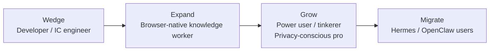

# 00 — Vision & Thesis

## Summary

Pane is the privacy-first, open-source **personal agent that is your browser**. It does everything an always-on, self-improving agent like [Hermes](https://hermes-agent.nousresearch.com) does — persistent memory, self-written skills, scheduled work, multi-channel reach, terminal and file control — but instead of attaching to your browser through a debug port and plugins, it **is** the browser. That inversion is the entire product. It gives Pane native, permissioned context on the work you already do, and lets it act directly instead of through a tool shim.

This spec defines the positioning, the thesis, the **ICP strategy and prioritization**, the per-ICP problem statements and flows, the competitive synthesis that justifies the bet, and the people we build for. Every other spec derives from here.

> **Review v0.2 note.** This version adds an explicit wedge ICP and sequencing (we win developers first, then expand to knowledge workers), per-ICP problem statements and primary flows, a competitive-defense section against the funded closed browsers (not only Hermes), a business-model thesis, and sharper non-goals. The earlier draft tried to serve four ICPs at once; this one picks a wedge.
>
> **Review v0.3 note.** Two corrections. (1) **Think in systems, not timelines** — the starting system state is a pure open-source project with **no Pane-operated servers**, so server-dependent things (marketplace, cloud sync, hosted credits, cloud-headless runner) are *future extension points*, not phases; **auto-skill-creation is a day-one intrinsic local capability** that needs zero servers. (2) We **build on BrowserOS**, not from scratch — most of the wedge is already shipped. Added "Build on BrowserOS" and "System states (A / B)" sections below; business model adjusted to server-optional-first.
>
> **Review v0.4 note (HoP pass).** Holistic review. Added: **a researcher/student flow** under the knowledge-worker ICP (passive capture + research buckets finally have an owner); a **"why a fork, not an extension"** defense (the obvious skeptical question); and **the no-default-model tension** — the sharpest risk the pure-OSS posture creates for mass-ICP activation, with a resolution (lead with OAuth subscriptions, local as the privacy path, default-credits re-enabled only as a later State B on-ramp). Decisions #9–#11 added.

---

## The thesis

> Most of your work lives in your browser. Separating the work from the assistant that helps with the work is a bug, not a feature.

Concretely:

1. **The browser is where work happens.** Tabs, logins, docs, dashboards, tickets, inboxes, code reviews, design files, bank portals, internal tools. The browser is the operating system of knowledge work.
2. **Context is the thing agents are missing.** Every external agent — Hermes included — reaches your work through a CDP bolt-on, a scraping tool, or an OAuth connector. Each is a lossy, partial view of what you're actually doing. The agent sees a snapshot, not the situation.
3. **When the agent is the browser, it gets the situation.** It sees the tab you're on, the tabs you have open, the page you came from, the file you just saved, the terminal command that failed, the ticket you've been avoiding for three days. It doesn't have to be told. It just knows.
4. **That context, with permission, compounds.** Memory becomes grounded in real activity instead of self-reported facts. Skills get written from real workflows instead of synthetic ones. Proactive nudges fire because the agent watched you do the same thing five mornings in a row, not because you set a cron job.

The claim is not "we are an agent that can also browse." The claim is "we are the browser, and the agent is native to it."

### The honest version of the moat

The Context Graph alone is a feature, not a moat — Atlas already has ChatGPT memory parity. The moat is the **combination**, which no competitor can assemble without giving up their core bet:

| Component | Why a competitor can't just copy it |
|-----------|--------------------------------------|
| Being-the-browser (native session) | Atlas/Comet/Dia could, but they're closed + cloud; Hermes/OpenClaw would have to become browsers |
| Local-first + open source (AGPL) | Atlas/Comet/Dia won't (cloud revenue model); Cowork won't (Claude-only) |
| Browser + workspace + terminal in one surface | Cowork has files but no web; Hermes has both but no native browser |
| Pane-as-MCP developer wedge | Chrome DevTools MCP is browser-only; we add workspace + context graph |
| Browser-grounded learning loop | Only works if you're the browser; Hermes learns from chat/terminal, not live browsing |

The defensible thing is the *intersection*, not any single piece. Specs should reinforce the intersection, not over-invest in one corner.

---

## Build on BrowserOS, not from scratch

We are not greenfield. Pane is built on [BrowserOS](https://github.com/browseros-ai/BrowserOS), which already ships the substrate for most of this spec set:

- **Browser:** a Chromium fork with native AI sidebar, MCP wiring, privacy patches, vertical tabs, MV2 ad blocking, glow indicator, Chrome import, voice input.
- **Agent runtime:** a Hono server (`/chat`, `/mcp`, `/agents`) with 53+ MCP tools (16 browser tools via `browser-mcp` + Cowork filesystem tools), Chat + Agent modes, session persistence.
- **Developer surface (the wedge):** Pane-as-MCP (`chrome://browseros/mcp`, one-line `claude mcp add`), `browseros-cli` (Go), harness agents (`AGENT_HARNESS_SUPPORT` for Claude Code/Codex). **Mostly shipped.**
- **Cowork:** filesystem tools (`ls`/`read`/`write`/`bash`/`search`) + folder picker — the seed of the Workspace spec.
- **Scheduled tasks + smart nudges**, **Connect Apps** (40+ via Klavis), **BYOK + OAuth + local models**, **eval harness**, **PostHog/Sentry**.
- **Pulled back in v0.46:** Skills, Soul, Memory — intentionally cleared to rebuild (this is the core net-new intrinsic work).

The net-new intrinsic work is therefore smaller than a from-scratch product: the **Context Graph**, the **Memory + auto-skill-creation engine** (rebuild), **Workspaces** (evolved from Cowork), **Tasks**, **Triggers** (evolved from scheduled tasks), **Reach** (peer-to-peer), and the **Trust framework**. Everything else is extension of what's there. See the capability map in [13 — System Architecture](./13-roadmap.md).

---

## System states: A (pure local) and B (optional servers)

The system is **complete and useful with no Pane-operated servers** (State A), and **designed to accept optional servers later** (State B) via defined extension points. Nothing in State A depends on a Pane server.

**State A — pure open-source, no Pane servers.** Models via BYOK / OAuth (provider servers, not Pane's) / local (Ollama, LM Studio). Context Graph, memory, and skills are local files + SQLite. **Skills are auto-created by the on-device learning loop** and importable from agentskills.io by URL/file — no marketplace needed. Scheduled work runs in-app + via OS keep-alive. Reach is peer-to-peer: OS push, the user's own SMTP/IMAP, a Telegram bot (Telegram's servers, not Pane's). Integrations via Klavis (third-party) + custom MCPs. The "becomes smarter every day" promise is fully delivered in State A.

**State B — optional Pane servers, future and conditional, plugged in behind interfaces.** Cloud sync, hosted credits/default-model on-ramp, hosted skills marketplace, cloud-headless scheduled runner, team/shared context. Each sits behind an adapter interface with a no-server fallback. They are revenue/scale surfaces, not dependencies — and **not shipped in the Pane fork today.** BrowserOS ships several Pane-operated server surfaces (cloud sync, credits, Remote Hermes, the cloud API); **these are disabled in the Pane fork.** State B is a future possibility ("if Pane gets famous, we might add server-side integration"), not a present reality. We define the interfaces only so a future server can plug in without redesigning the core.

The architecture rule: **every State B extension has a no-server fallback.** If a Pane server never ships for a given extension, the product is still complete. This is what keeps the local-first, open-source promise credible even if we monetize later.

---

## ICP strategy: wedge, then expand

A product that tries to win four ICPs at once wins none. We pick a **wedge ICP**, win it, and expand in a deliberate order. The wedge is chosen for differentiation, time-to-value, and word-of-mouth — not for market size. Market size comes later.

| Stage | ICP | Why this order |
|------|-----|----------------|
| **Wedge (win first)** | Developer / IC engineer | Most differentiated (no one serves devs with a browser+workspace+MCP), partly shipped, high-intent, tolerates setup, drives word-of-mouth and content. Smallest market but highest conversion. |
| **Expand** | Browser-native knowledge worker | The big market. We earn the right to fight Atlas/Comet/Dia here only after the agent + context graph are genuinely good (proven on devs). |
| **Grow** | Power user / tinkerer; privacy-conscious pro | Natural pull-through from openness + BYOK + local models. Low marginal cost to serve. |
| **Migrate** | Hermes / OpenClaw users | Small but high-intent; migration is an acquisition channel, not an ICP. |

**The implication for sequencing:** the first user-facing proof of the thesis (the wedge flow) is the developer one — *open the app, point Claude Code at Pane, reproduce a bug in your real session, fix it*. That flow must be excellent before we optimize the knowledge-worker flows. See [13 — Roadmap](./13-roadmap.md).

---

## Per-ICP problem statements, flows, and success signals

### Wedge — Developer / IC engineer

- **Problem statement (the "context tax"):** A frontend bug costs a developer 5–15 context switches per cycle — terminal to run the dev server, browser to reproduce, IDE to read code, back to browser to read console errors, back to IDE to fix, back to browser to verify. Each switch is a mental reload. Coding agents (Claude Code, Codex) own the IDE half but can't touch the user's real, authenticated browser session, so they either can't reproduce UI bugs or do it in a fake WebDriver-flagged session that breaks logins.
- **Primary flow:** Developer points Claude Code (or Cursor) at Pane via one MCP URL. Says "open localhost:3000, click Sign up, read the console errors, fix the bug." Pane runs the browser loop in the developer's real session, returns the console output + a screenshot; the coding agent edits the repo in the granted workspace, runs `make test` via Pane's terminal, Pane re-verifies in the browser. One loop, one session, no copy-paste.
- **Success signal:** A developer reproduces and fixes a UI bug end-to-end from their coding agent without leaving the agent's prompt, within one session, on day one.
- **Pane must be true:** Pane-as-MCP is one-line setup; workspace + terminal sandbox is safe enough to grant; harness agents compose without approval spam; the browser is the developer's *real* logged-in session.

### Expand — Browser-native knowledge worker

- **Problem statement:** Research, drafting, extraction, and form-filling live in the browser, but the assistant lives in a separate tab/app. The worker copies URLs, screenshots, and page text into ChatGPT or Claude, loses context, and the agent can't act on the page even when it understands it. Repeat work (weekly reports, competitor scans, inbox triage) is done manually every time.
- **Primary flow:** The worker opens a long thread or dashboard, opens the Pane side panel, and says "summarize this and draft a reply" (Chat) or "pull these three numbers into my weekly report and save it to my workspace" (Agent). The next time, Pane offers to schedule it; one click and it runs every Monday.
- **Success signal:** A knowledge worker ships a weekly report draft they didn't hand-write, and schedules its next run, within the first week.
- **Pane must be true:** Side-panel Chat is fast and page-grounded; Agent mode handles multi-tab extraction + file writes; "save as scheduled" is one click; the agent's work is visible and reversible.

### Expand — Researcher / student (a flow within the knowledge-worker ICP)

- **Problem statement:** Research is a wandering, multi-tab, multi-day activity — papers, docs, videos, notes scattered across tabs and tools. There's no one place that captures *what you looked at, in what order, toward what question*, and turns it into structured notes. Students/researchers stitch together Zotero + Notion + tab groups + screenshot tools.
- **Primary flow:** While researching, the user keeps browsing; Pane passively builds a **research bucket** ([14](./14-passive-capture-and-context-buckets.md)) — the chain of pages opened toward a question, with key extractions. The user asks "draft a lit review from what I've read this week" and Pane pulls from the bucket, with citations back to the source tabs.
- **Success signal:** A researcher produces a structured note or outline from a week of browsing they did *not* manually bookmark, with every claim traceable to a source tab.
- **Pane must be true:** Passive browsing capture is consented and accurate; the research bucket is editable and exportable; retrieval surfaces sources, not just claims (the anti-hallucination discipline).

### Grow — Power user / tinkerer

- **Problem statement:** Wants a self-improving personal agent with persistent memory, self-written skills, and their own models — but doesn't want to run a VPS, a daemon, or babysit a Node process (the Hermes/OpenClaw setup tax).
- **Primary flow:** Installs Pane, picks a local model (Ollama) or BYOK, grants a workspace, and over weeks watches the agent write skills from their real workflows and remember their preferences — all on-device, inspectable.
- **Success signal:** A tinkerer has ≥3 agent-written skills in active use at D30 and has edited `soul.md` or `USER.md`.
- **Pane must be true:** Memory + learning loop work on local models (or cheap cloud); skills are plain files; nothing is a black box.

### Grow — Privacy-conscious professional

- **Problem statement:** Wants agent help with browsing, docs, and email but will not send their browsing, files, or credentials to a vendor cloud (legal, finance, healthcare, security constraints).
- **Primary flow:** Installs Pane, keeps everything local, connects only the integrations they choose, and uses Agent mode for research and drafting with approvals on any outbound action.
- **Success signal:** A privacy-pro user is a daily Pane assistant user at D30 with zero cloud sync enabled.
- **Pane must be true:** Local-first is real (no silent exfiltration), approvals are trustworthy, the trust panel is honest, local models are usable for Chat.

### Migrate — Hermes / OpenClaw user

- **Problem statement:** Already has memory, skills, channels, and keys in another agent; wants the richer browser context of Pane but doesn't want to start over.
- **Primary flow:** Onboarding detects their existing install, offers a migration wizard, imports memory + skills + channels + keys, and runs a verify task.
- **Success signal:** A migrant has their skills running in Pane within the first session and has not returned to their old daemon by D7.
- **Pane must be true:** Migration is one-click, lossless for the common case, and Pane is a strict superset of what they had.

---

## A browser that becomes yours (the shape-shifting thesis)

The README's headline is **"a browser with a soul"** — and the product vision that follows from it is *one product that takes a shape that fits your life*, not the same chatbot for everyone. That is a product vision, separate from (and compatible with) the GTM wedge above. The wedge says *who we win first*; this says *what the product becomes for any one user over time*.

The README names the shapes Pane should take:

- **Chief of staff** — morning briefings, meetings captured and summarized, follow-ups tracked, investor updates drafted from the week you actually lived in tabs.
- **Job search partner** — fit scores on listings against your background, applications organized, company research threaded, interview prep from pages you already read.
- **Research & study buddy** — papers and threads that survive the tab close, citations back to sources, outlines from a week of browsing toward one question.
- **Whatever else you need** — because Pane learns your workflows, writes skills when you repeat them, and scopes memory into buckets so work, job hunt, and personal life do not bleed into each other.

This is not four products. It is **one product whose persona, context, and surface adapt to you** — and the adaptation is powered by intrinsic, local, no-server capabilities we already spec:

| README vision | What makes it real in Pane | Spec |
|---------------|----------------------------|------|
| "A browser with a soul" | `soul.md` — the agent's identity and active persona, a plain editable file | [11](./11-personalization-skills-marketplace.md), [04](./04-memory-and-learning-loop.md) |
| "Becomes whatever you need it to be" | Persona follows the active context bucket; the loop proposes persona shifts from your real activity | [11](./11-personalization-skills-marketplace.md), [14](./14-passive-capture-and-context-buckets.md) |
| "A new tab that knows your day" — auto-evolving widgets | The adaptive home: widgets (next meeting w/ prior notes, pending PRs, resumed research, one-click recurring report, daily digest) that rearrange as Pane learns your rhythms | [15](./15-adaptive-home.md) |
| "Pages reshaped for you" — fit scores, margin notes, feeds without the slop | Page reshape & overlays: Pane reads a page in the context of *your* goals and layers what you need on top of it (reversible, consented, clearly marked) | [16](./16-page-reshape-and-overlays.md) |
| "Remembers you and improves itself" | Browser-grounded memory + auto-written skills + curation | [04](./04-memory-and-learning-loop.md) |
| "Capture what you'd otherwise lose" | Meeting recordings/notes + browsing learnings + research buckets | [14](./14-passive-capture-and-context-buckets.md) |

The shape-shifting is the *visible* payoff of the soul + memory + graph + capture system; without those, "becomes yours" is a marketing line. The adaptive home and page reshape are where the loop becomes something the user *feels* every time they open a tab or a page. We build the engine first (memory, graph, capture), then the surfaces that express it (adaptive home, page reshape) — see [13](./13-roadmap.md) and the [Implementation Plan](./IMPLEMENTATION-PLAN.md).

---

## Positioning

**One-line:** The open-source, local-first, self-improving personal agent — that is also your browser.

**Category:** Agentic browser (Chromium fork) **+** always-on personal agent runtime.

**The sentence we want people to repeat:**
- For devs: "Pane is the browser my coding agent drives — my real session, my repo, one MCP URL."
- For everyone: "Pane is the only AI browser that's open source and runs on my machine."

### Positioning matrix

| Dimension | Pane | Hermes | OpenClaw | Claude Cowork | Atlas / Comet / Dia |
|-----------|------|--------|----------|---------------|---------------------|
| Where the agent lives | **In the browser** | Server / VPS daemon | Daemon, messaged via chat apps | Claude Desktop VM | Cloud sidebar |
| Browser context | **Native, full session** | CDP bolt-on (separate process) | CDP bolt-on (separate process) | None | Native, but closed + cloud |
| Memory | 5-layer, browser-grounded + `soul.md` persona | 5-layer, conversation-grounded | Manual skills + soul | Session-scoped | ChatGPT/Perplexity memory, cloud |
| Self-improving skills | Yes (agentskills.io) | Yes (agentskills.io) | Hand-written only | No | Limited "skills" (Dia) |
| Always-on / scheduled | Yes (in-browser + optional keep-alive) | Yes (24/7 daemon) | Yes (daemon + cron) | No (on-demand) | Limited (Atlas tasks) |
| Multi-channel reach | Yes (later phases) | Yes (Telegram/Discord/Slack/…) | Yes (20+ channels) | No | No |
| Files + terminal | Yes (workspace + sandboxed shell) | Yes | Yes | Yes (VM) | No |
| Models | BYOK + local (Ollama/LM Studio) + OAuth | 300+ via OpenRouter | Multiple w/ failover | Claude only | Single vendor |
| Privacy | **Local-first, open source (AGPL)** | Self-hosted, open source | Self-hosted, open source | Cloud | Cloud, closed |
| Developer surface | **Pane-as-MCP + CLI + Claude Code/Cursor** | CLI + ACP | Skills hub | Desktop only | None |

---

## Competitive defense (how we hold the line)

We are the open, local-first underdog against well-funded closed browsers. We don't win by out-spending them; we win on the things their business model forbids them from doing.

### Why a fork, not an extension

The obvious skeptical question: *why ship a whole Chromium fork when a powerful extension (Arc/Edge + extension, or a Chrome extension) could do most of this?* The fork is load-bearing, not vanity:

- **Passive capture at the source.** An extension can read page DOM, but meeting-tab **audio capture**, tab-level media, and cross-tab activity streams require privileged access extensions are progressively denied (Manifest V3 service-worker lifecycle, `getDisplayMedia` gating, site isolation). The fork captures natively and persistently ([14](./14-passive-capture-and-context-buckets.md)).
- **A real agent runtime, not a guest.** Extensions are throttled, killed, and sandboxed; an always-on agent loop + local model host + scheduled work + OS keep-alive can't live reliably inside an extension process. The fork ships the runtime as a first-class process.
- **The developer surface.** Pane-as-MCP exposing the user's *real, authenticated* session to Claude Code is only credible from the browser process itself, not from an extension proxying CDP.
- **Privacy at the lineage.** ungoogled-chromium privacy patches, MV2 ad blocking, no vendor telemetry — none of which an extension can guarantee on top of a browser that phones home.

The cost is real (fork maintenance, signed builds, update channel — see [13](./13-roadmap.md)). We pay it because the thesis breaks without it. An extension is the *State B downgrade* a competitor would offer; it's strictly less.

| If the closed browsers… | …we respond by |
|------------------------|-----------------|
| Ship a polished cloud agent | Leading with local-first + BYOK + open source; being the credible choice for anyone who can't or won't send browsing to a vendor |
| Bundle "unlimited" AI | Keeping BYOK + OAuth subscriptions (use the ChatGPT Pro/Copilot you already pay for inside Pane); never locking the model |
| Add memory/personalization | Shipping an *inspectable, revocable, on-device* memory + the Context Graph (they can't make theirs inspectable without admitting what they collect) |
| Get serious about devs | Already owning the dev wedge: browser + workspace + terminal + MCP in one URL, with the user's real session — they'd have to open up and add a filesystem |
| Cut prices / go free | Staying free + open; monetizing hosted inference, sync, and team features, not the core (see business model below) |
| Claim prompt-injection is "solved" | Being honest that it isn't, and giving the user structural control (approvals, audit, isolation) — trust as a feature |

The defensive rhythm: every quarter, ship one thing the closed browsers structurally can't match without giving up their cloud/closed bet. The Context Graph's inspectability, the local-first memory, the developer MCP wedge, and the open skills format are the first four.

---

## Business model (product-level thesis)

Consistent with local-first + open source, and with the **system-states** model: the **State A product is free OSS forever and needs no Pane server**. Revenue comes only from **State B** — things that cost us to run or that scale beyond a single user. Every revenue stream is behind an interface with a no-server fallback.

| Stream | State | Why it's consistent |
|--------|-------|---------------------|
| **The OSS core (State A)** | Free, forever, no server | Local-first + open source is the moat; it must stay credible. |
| **Default credits / partnerships** (e.g. Kimi) | State B (optional on-ramp) | A no-keys trial adapter; the system is full-featured BYOK/local/OAuth without it. |
| **Hosted inference / credits** | State B | Optional; for users who don't want BYOK. |
| **Cloud sync + multi-device** | State B (sync adapter) | Opt-in; the local-only path is always full-featured. |
| **Cloud-headless scheduled runner** | State B (runner adapter) | The honest answer to "Hermes runs on a VPS"; paid, isolated from live sessions. |
| **Skills marketplace** | State B (directory source) | Hosted discovery/publishing; **the intrinsic skill system + agentskills.io import already work without it.** |
| **Team / shared context** | State B (shared-graph adapter) | Later, sales-led. |

We do **not** monetize: ads, selling data, locking the model, or paywalling the local agent. The thesis depends on the State-A promise being credible; breaking it kills the moat.

### The no-default-model tension (a real risk the pure-OSS posture creates)

Disabling Pane-operated servers means **no hosted-credits on-ramp** in the Pane fork. For the **developer wedge this is fine** — devs already have API keys or OAuth subscriptions. For the **expand/grow ICPs it is a cold-start wall**: a non-technical knowledge worker who downloads Pane must, before first value, *either* paste an API key, *or* authenticate an OAuth subscription (ChatGPT Pro/Copilot/Qwen — they may already have one), *or* install and run a local model (slow, lower quality, hardware-dependent). Each path is friction the closed browsers don't have (they ship a working model on minute one).

This is the sharpest tension between "pure-OSS, no servers" and "win the mass ICP." Resolution for now:

- **Lead the mass-ICP onboarding with OAuth subscriptions** ("use the ChatGPT Pro / Copilot you already pay for") — no Pane server, no new key to paste, often already logged in.
- **Local models as the privacy path**, with honest expectation-setting (Chat is great on local; Agent wants a strong model).
- **Default credits (Kimi) are the State B on-ramp we re-enable later** if adoption justifies it — explicitly *not* a launch dependency.
- **Accept that the wedge (devs) carries activation until the agent + Context Graph are good enough to justify the mass-ICP setup tax.** This is consistent with "earn the right to expand."

The risk is named, not hidden. If mass-ICP activation collapses on the model step, the answer is *not* to silently re-add a server — it's to make OAuth-subscription onboarding frictionless first.

---

## Why now

- **Agentic browsers went GA in 2025–2026.** Atlas (Oct 2025), Comet, Dia all reached broad availability. The category exists and users understand it. But all three are closed and cloud-dependent.
- **Prompt injection is an acknowledged unsolved problem.** OpenAI wrote in Dec 2025 that it is "unlikely to ever be fully solved." The closed browsers handle this by limiting the agent's surface. An open, local-first browser can offer a different answer: full surface, with user-controlled approvals, isolation, and inspectability (see [10 — Trust](./10-trust-privacy-security.md)).
- **Self-hosted agents hit the mainstream.** Hermes (Nous Research, Feb 2026) popularized the "always-on personal agent that gets smarter" model. The demand is proven; the complaint is setup (VPS, daemon, Node, CDP). Pane removes that complaint by being the app you already run.
- **Devs are actively wiring coding agents to browsers** via Chrome DevTools MCP — proving demand for the wedge, with a clear gap (no workspace, no context, debug-flagged session).
- **v0.46 pulled Skills/Soul/Memory back to rebuild them.** Pane deliberately cleared the decks. This is the rebuild.

---

## Who we build for (prioritized)

Mirrors the wedge→expand order above. Detailed per-ICP problem statements and flows are in the section above; this is the persona shorthand.

### Wedge
- **Developer / IC engineer** — automate the browser + repo + terminal from Claude Code/Cursor, in the real session.

### Expand
- **Browser-native knowledge worker** — research, draft, extract, fill forms, schedule repeat work, all in the browser.

### Grow
- **Power user / tinkerer** — self-improving agent with own models, no VPS.
- **Privacy-conscious professional** — agent help without the cloud.

### Migrate (acquisition channel, not an ICP)
- **Hermes / OpenClaw users** — bring their memory, skills, channels, keys.

### Anti-personas (explicit non-fit for this thesis)

- **"I want AI only in WhatsApp/Telegram on my phone."** That's OpenClaw or Hermes-with-gateway. Pane is a desktop browser first; we meet mobile via reach ([08](./08-reach-and-channels.md)), we don't pretend to be a chat-app agent.
- **"I need polished Office docs (Excel formulas, PowerPoint)."** Claude Cowork's VM doc stack is stronger. Pane's strength is the live web + files, not document rendering.
- **"I want zero setup and unlimited cloud AI, and I don't care about openness."** Atlas/Comet are simpler. Pane will always ask the user to pick a model.
- **"I want a 24/7 headless server agent on a $5 VPS I never look at."** Hermes is the right tool. Pane's always-on is a feature of an app you use, not a headless server product ([07](./07-proactive-and-scheduled-work.md)).
- **"I want a team/shared agent today."** Not yet. Single-user first; team is a later, cloud, sales-led expansion.

---

## The promise we make to users

1. **Your work and your agent are not separated.** The agent sees what you see, where you see it.
2. **It gets smarter from your real work.** Memory and skills are grounded in your actual browsing and files, not what you remembered to tell it.
3. **It reaches you where you are.** When you step away from the browser, it can still ping you (later phases).
4. **It is yours.** Your models, your keys, your machine. Open source, inspectable, no vendor lock-in.
5. **It shows its work.** Every action is visible, reversible where possible, and auditable. You are always in control.

---

## What "better than Hermes" means, specifically

The thesis is testable. Pane should beat Hermes on these concrete axes:

| Axis | Hermes today | Pane target |
|------|--------------|-------------|
| Setup | curl + VPS + daemon + config.yaml + CDP | Download a browser |
| Browser context | Snapshot via CDP of a separate Chrome | Live, full session, all tabs, history, logins |
| Memory grounding | Conversation-derived facts | Conversation + browsing + file + terminal activity |
| Skill provenance | Written from terminal/chat workflows | Written from real browser workflows (clicks, forms, multi-tab) |
| Reaching your work | Plugins, connectors, CDP | Native — no connector needed for anything in the browser |
| Visibility | Logs in a terminal | In-browser glow, tool batches, replay |
| **Meeting notes** | Separate product (Otter/Granola) + a bot | Native: the meeting tab is captured in-browser, transcribed locally, filed in a bucket ([14](./14-passive-capture-and-context-buckets.md)) |
| **Browsing learnings** | Not part of the product | Native: passive observation → memory + skill candidates ([14](./14-passive-capture-and-context-buckets.md)) |
| **Scoped context** | One memory blob | Bucketed context so work doesn't leak into personal ([14](./14-passive-capture-and-context-buckets.md)) |

The "we are the browser" examples that no external agent can match: **automatic meeting recordings + notes** (web meetings run in a tab — no bot, no separate app, no vendor cloud recording) and **learnings from your browsing** (the agent watches, with consent, and gets smarter from real activity). Today users stitch together separate products for each of these; Pane folds them into the browser itself. See [14 — Passive Capture & Context Buckets](./14-passive-capture-and-context-buckets.md).

The honest gaps Pane must close to make the thesis true (and that the specs address):

- **Always-on without a browser window.** Hermes runs 24/7 on a VPS. Pane is an app. v1 answer: in-app scheduler + optional OS keep-alive; cloud-headless is a later opt-in paid feature, not a v1 dependency (see [07](./07-proactive-and-scheduled-work.md)).
- **Memory + skills don't exist yet in Pane.** v0.46 pulled them back. [04](./04-memory-and-learning-loop.md) and [11](./11-personalization-skills-marketplace.md) rebuild them, browser-grounded.
- **Multi-channel reach.** Pane has none today. [08](./08-reach-and-channels.md) adds it conservatively (OS push + email first), with migration from Hermes/OpenClaw.

---

## Decisions made in this review (resolving earlier open questions)

1. **Wedge ICP is the developer.** Knowledge worker is the expand target, not the lead.
2. **Public framing** leads with "open-source, local-first AI browser" (mass) and "the browser your coding agent drives" (devs). "Hermes-as-a-browser" is internal shorthand.
3. **System model = State A first.** The product is complete with no Pane-operated servers. Cloud sync, hosted credits, the skills marketplace, and the cloud-headless runner are State B extension points behind no-server-fallback interfaces — not launch dependencies.
4. **Auto-skill-creation is a day-one intrinsic capability.** The system becomes smarter on-device, with zero servers, like Hermes/OpenClaw. The marketplace is a future discovery layer on top of an already-working skill system.
5. **Always-on v1 = in-app + OS keep-alive.** Cloud-headless is a later State B opt-in.
6. **We build on BrowserOS.** Specs anchor on existing substrates (agent server, 53 tools, Cowork, Pane-as-MCP, CLI, scheduled tasks, Connect Apps) and extend; we don't rebuild them.
7. **Pane-operated server surfaces are disabled in the Pane fork.** BrowserOS ships cloud sync, credits, Remote Hermes, and a cloud API; Pane ships **State A only** for now. State B is future and conditional on adoption. Third-party integrations (Connect Apps via Klavis, custom MCPs, BYOK transcription) stay because they're not Pane servers.
8. **Passive capture is a flagship intrinsic capability.** Meeting recordings + notes and browsing learnings — normally separate products — are native to Pane because it's the browser. Context is bucketed so work and personal stay separate. See [14](./14-passive-capture-and-context-buckets.md).
9. **Researcher/student is a flow within the knowledge-worker ICP**, not a fifth ICP — passive capture + research buckets serve it; we avoid splitting focus across another ICP before the wedge is won.
10. **The fork is load-bearing.** Passive audio capture, a persistent agent runtime, the developer MCP surface, and lineage privacy all require being the browser process — an extension is the strict-subset downgrade a competitor would offer.
11. **The no-default-model tension is acknowledged, not hidden.** Pure-OSS-no-servers removes the hosted-credits on-ramp; mass-ICP onboarding leads with OAuth subscriptions + local models, and default-credits return only as a later State B on-ramp if adoption justifies it.

## Open questions

1. **Naming**: is "Pane" the agent name and "Pane Browser" the app, or vice versa? The thesis makes the agent primary. *Decision needed.*
2. **Wedge timing**: do we publicly commit to the dev-first positioning in the next release notes, or ship the dev wedge quietly while the product still reads as a general AI browser? *Lean: commit publicly — devs respond to being the named audience.*
3. **Business model pricing**: credits vs. sync-subscription vs. headless-runner-subscription as the primary paid lever. *Decision needed; inform with early credit usage data.*
4. **Team/shared context**: when do we start the team surface? *Lean: not until single-user D30 retention is healthy; premature team features distract.*

---

## Related specs

- [01 — Product Principles](./01-product-principles.md) — the tenets that operationalize this thesis (now including focus/wedge).
- [02 — The Context Graph](./02-the-context-graph.md) — the substrate this thesis depends on.
- [13 — Roadmap](./13-roadmap.md) — re-sequenced around the wedge ICP.
