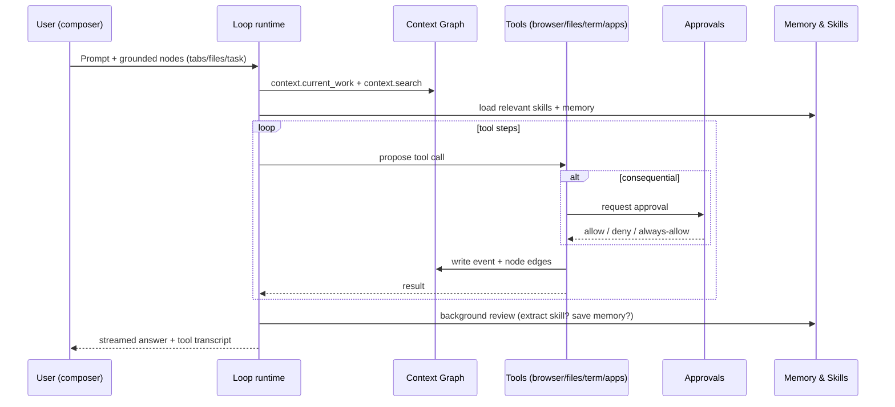

# 03 — Agent Modes & The Loop

## Summary

This spec defines how the user talks to the Pane agent and how the agent acts. It covers the **Chat** and **Agent** modes, the tool loop that drives Agent mode, how actions are made visible and reversible, the approval model for consequential actions, and how the user routes a job to the right model. The agent in Pane is the same always-on, self-improving agent described across these specs; this spec is the interaction surface and the execution runtime.

> **Review v0.2 note.** **Graph mode is deferred** (not shipped in the wedge or expand phases). "Save as scheduled" from an agent run covers the durable repeatable-work need; a visual canvas returns only if authoring data justifies it (see kill criteria). Also decided: **Chat mode may use read-only context tools** (`context.search`/`recall`) — it stays non-mutating but gets recall. Added a **`<30s` to first useful action** goal for Chat.
>
> **Review v0.3 note.** Anchored on the **existing BrowserOS agent loop** — `apps/server` (`/chat`, `/mcp`, `/agents`), the AI SDK `ToolLoopAgent`, Chat + Agent modes (GA), and harness-agent support. This spec *refines* the loop (grounding in the Context Graph, glows, approvals, model routing) rather than building it. Graph mode ("coming soon" in public docs) remains deferred. All intrinsic; no Pane server required.
>
> **Review v0.4 note (HoP pass).** Added a **dry-run cross-ref** to the training-wheels model in [10](./10-trust-privacy-security.md) (the loop emits *proposed* scary actions for user promotion, not immediate execution) and fixed a stale "Save as Graph" user story → "Save as scheduled" (Graph is deferred).

---

## Goals

- Provide one coherent assistant experience across the side panel, new tab, command center, and external clients.
- Make agent work **visible, interruptible, and auditable** (principles 5 and 7).
- Let the user choose the right level of autonomy per task (chat → agent → graph → scheduled).
- Route each task to the model that fits it (BYOK / OAuth / local), with sensible defaults and clear recommendations.

## Non-goals

- Replacing the underlying `ToolLoopAgent` (AI SDK v6) runtime — this spec designs on top of it.
- Defining the memory and skills system (see [04](./04-memory-and-learning-loop.md)).
- Defining scheduled/proactive execution (see [07](./07-proactive-and-scheduled-work.md)).

---

## The two modes (Graph deferred)

| Mode | Intent | Autonomy | Best model | Status |
|------|--------|----------|------------|--------|
| **Chat** | Ask about the current page or attached context; summarize, translate, extract, explain; recall past work. | None — answers only; read-only context tools allowed, no mutating tools. | Any, including local. | GA (refined) |
| **Agent** | Multi-step work: navigate, click, type, extract, write files, call apps, run commands. | Tool loop with approvals on consequential actions. | Strong reasoning recommended (Claude Opus/Sonnet, GPT-class). | GA (refined) |
| ~~Graph~~ | ~~Repeatable visual workflows.~~ | ~~Deterministic-ish.~~ | ~~Per node.~~ | **Deferred** — "Save as scheduled" covers the need; returns only with authoring data. |

### Chat vs Agent (product guidance, refined from PRODUCT.md)

- **Chat** is low-friction, page-grounded, and **non-mutating**. It reads `context.current_work`, the active/attached tabs, and may call **read-only** context tools (`context.search`, `context.recall`) to pull past work — but it never mutates the browser, files, or apps. Local models are great here. **Target: first useful Chat response in < 30 seconds from opening the side panel.**
- **Agent** is the workhorse. It runs the tool loop, calls the browser tools (53+), workspace/terminal tools, app integrations, and context tools. Consequential actions gate on approval. It is the mode that writes skills and updates memory.
- **Graph** (deferred) was to be the visual sibling of scheduled tasks. We cut it from the near-term plan because "Save as scheduled" from an Agent run covers the repeatable-work need with far less surface area. A visual canvas returns only if data shows users are authoring non-trivial scheduled workflows and want a canvas (see kill criteria and [07](./07-proactive-and-scheduled-work.md)).

### Harness agents (refinement)

Pane already supports Claude Code and Codex as first-class targets (`AGENT_HARNESS_SUPPORT`). We keep and clarify this: in Agent mode, the user can delegate a sub-task to a **harness agent** (Claude Code, Codex, Qwen Code) running in the workspace, while Pane provides the browser context and the Context Graph. This is how Pane becomes the browser for coding agents, not a competitor to them.

---

## The loop

- **Grounding**: every turn starts by pulling `context.current_work` and any explicit attachments, plus a `context.search` for relevant memory/skills. The user sees grounding chips and can edit them.
- **Skill loading**: only the **skill index** (names + one-line descriptions) sits in the system prompt; full `SKILL.md` bodies load on demand (the Hermes "no heavy backpack" lesson).
- **Tool transcript**: each tool call renders as a batch (visible in the UI today); each batch links to the graph event it produced.
- **Background review**: after a successful multi-step run, a cheaper-model review proposes a skill and/or memory write (see [04](./04-memory-and-learning-loop.md)). The user can gate these writes.

---

## Visibility & control

- **Tab glow**: the active tab the agent is working pulses orange (exists today). Extended to **per-domain glows**: file edits, terminal runs, and app sends each get a distinct indicator.
- **Tool batches**: grouped, collapsible, with input/output and a link to the resulting graph node.
- **Live snapshot**: a "watch" view shows the agent's current page snapshot so the user can see what it sees.
- **Interrupt**: a single stop button halts the loop between tool calls (never mid-action that has side effects; we finish the in-flight consequential action or cancel cleanly).
- **Replay**: every agent run is stored as a graph node and replayable step-by-step (ties to [02](./02-the-context-graph.md) and [10](./10-trust-privacy-security.md)).
- **Undo where possible**: for reversible actions (a created file, a draft email not sent), offer an undo affordance in the transcript.
- **Dry-run for the scary classes**: `write-external`/`system`/`spend` draft-and-show or preview-and-confirm by default; see the "training wheels" section in [10](./10-trust-privacy-security.md). The loop emits the *proposed* action for user promotion rather than executing immediately.

---

## Approvals & consequence classes

Every tool declares a **consequence class**. Defaults err toward asking (principle 7).

| Class | Examples | Default behavior |
|-------|----------|------------------|
| `read` | snapshot, read page, search context, list files | Run freely |
| `write-local` | create/edit file in workspace, organize tabs/bookmarks | Run freely in granted workspaces; first-time confirm |
| `write-external` | send email/Slack, post comment, create ticket, push commit | **Require approval** first time; can pin as trusted per (target, action) |
| `system` | terminal command with side effects, install package, run script outside sandbox | **Require approval every time** unless pinned by explicit, time-boxed trust |
| `spend` | anything that costs money (buy, subscribe, paid API) | **Always require approval**, never auto-allow |

Trust pins:
- "Always allow Slack posts to #eng" is a per-(connection, channel, action) pin, revocable from the Context panel.
- Pins expire (default 30 days) and the user is reminded before expiry.
- `spend` cannot be pinned.

See [10 — Trust](./10-trust-privacy-security.md) for the security model around approvals and prompt-injection defense.

---

## Model routing

- **Per-mode default**: Chat → user's chat default (local OK); Agent → user's agent default (strong reasoning recommended); Graph → per-node.
- **Per-task override**: the composer lets the user pick a model for this turn only (already partially present as provider picker).
- **Recommendations**: when the user starts Agent mode with a weak/local model, show a one-time, dismissable note that agent work does better with strong reasoning models, with a one-click switch.
- **Auxiliary models**: background review (skill/memory extraction) runs on a cheaper model by default (the Hermes lesson: ~3–5× cheaper, near-identical capture). Configurable.
- **OAuth subscription models** (ChatGPT Pro, Copilot, Qwen Code): first-class in the picker, no extra API spend.

---

## Surfaces

| Surface | Modes | Notes |
|---------|-------|-------|
| **Side panel** | Chat, Agent | Primary loop while browsing. Exists today; refined with grounding chips and glows. |
| **New tab / Home** | Chat, Agent, → Graph | Unified composer + agent command center. `/home`. |
| **Agent Command** | Agent | Dedicated full-screen conversation for long agent work. `/home/agents/:id`. Exists today. |
| ~~**Graph editor**~~ | ~~Graph~~ | **Deferred.** Repeatable work is authored via "Save as scheduled" from Agent runs and the Scheduled Tasks UI. |
| **External clients** (Claude Code, Cursor, CLI) | Agent (headless) | Same loop, driven via MCP. **This is the wedge surface.** See [09](./09-integrations-mcp-developer-surface.md). |
| **Channels** (Telegram, email, mobile) | Chat, lightweight Agent | Reach surface; see [08](./08-reach-and-channels.md). |

---

## User stories

- "I'm on a long support thread. I hit Chat and ask 'summarize and draft a reply' — it reads the page, drafts, and I send it myself."
- "I'm filling a 12-field form from a PDF. I switch to Agent, say 'fill this form from the attached file', approve the first field, pin the rest, and it completes."
- "I want to repeat 'scrape competitor pricing every Monday and update my sheet'. I build it once in Agent, then **Save as scheduled** and schedule it."
- "From Claude Code I say 'open the staging admin, reproduce the bug, read the console'. Pane runs the loop in my real session and returns the console errors."

---

## Interactions with other specs

- **02 — Context Graph**: the loop reads and writes the graph; tools emit events.
- **04 — Memory & Learning Loop**: runs the background review; skills are loaded into the loop.
- **05 — Workspace, Files & Terminal**: provides the `write-local`/`system` tools and the sandbox.
- **06 — Task & Work Management**: an agent run can be attached to a task and create follow-ups.
- **07 — Proactive & Scheduled Work**: Graph mode is the visual authoring surface for scheduled work.
- **09 — Integrations & MCP**: external clients drive the same loop; app tools are `write-external`.
- **10 — Trust**: owns the approval and prompt-injection mechanics this spec relies on.

---

## Edge cases

- **Agent stuck in a loop**: a max-step budget and a "no progress for N steps" tripwire halt the run and ask the user.
- **Approval timeout on a scheduled run**: if a consequential action needs approval but the user is away, the run pauses and posts a channel notification ([08](./08-reach-and-channels.md)) asking for approval; never auto-approves.
- **Conflicting grounding**: user attaches tab A but references tab B. The agent asks which to use rather than guessing.
- **Local model + Agent mode**: enforce the expectation-setting note; offer "try with a cloud model for this task" if the run fails twice.
- **Harness agent + browser**: when a coding agent is driving, Pane still owns approvals for `write-external`/`system`; the harness is sandboxed to the workspace.

---

## Kill criteria

- **Graph mode** is the riskiest new surface. Pull it back if authored graphs rarely run more than once (i.e. it's not actually repeatable-work) or if the canvas has a high abandon-rate at authoring. Fall back to "scheduled tasks from agent runs" (text form) as the durable path.
- If approval prompts are dismissed/ignored >40% of the time, the consequence classes are miscalibrated — re-tune before considering a UX change.

---

## Open questions

1. ~~**Is Graph a separate editor or an evolution of Scheduled Tasks?**~~ **Decision (v0.2): Graph is deferred.** "Save as scheduled" from agent runs is the durable authoring path. A visual canvas returns only if authoring data justifies it.
2. ~~**Should Chat be allowed to call read-only context tools?**~~ **Decision (v0.2): yes** — `context.search` and `context.recall` are read-only and make Chat dramatically more useful without autonomy risk.
3. **How do harness-agent approvals compose with Pane approvals** when both are in the loop? *Lean: Pane is the outer authority; harness runs are sandboxed and never get `write-external`/`spend`.*
4. **Do we show the model recommendation nag in Chat too**, or only Agent? *Lean: only Agent, where it matters.*
5. **The `<30s` first-Chat goal**: is it measured from side-panel open or from first keystroke? *Lean: from side-panel open — perceived latency is what matters.*

---

## Metrics

- **Mode mix**: Chat vs Agent vs Graph session share (watch Graph cannibalization of Scheduled Tasks).
- **Agent task completion rate** (eval harness + real runs).
- **Tool calls per agent session** and **approval grant rate**.
- **First-time approval → pin conversion** (are approvals low-friction enough?).
- **Interrupt rate** (runs the user stopped) and reason codes.
- **Local-model Agent failure rate** → upgrade-to-cloud conversion.
