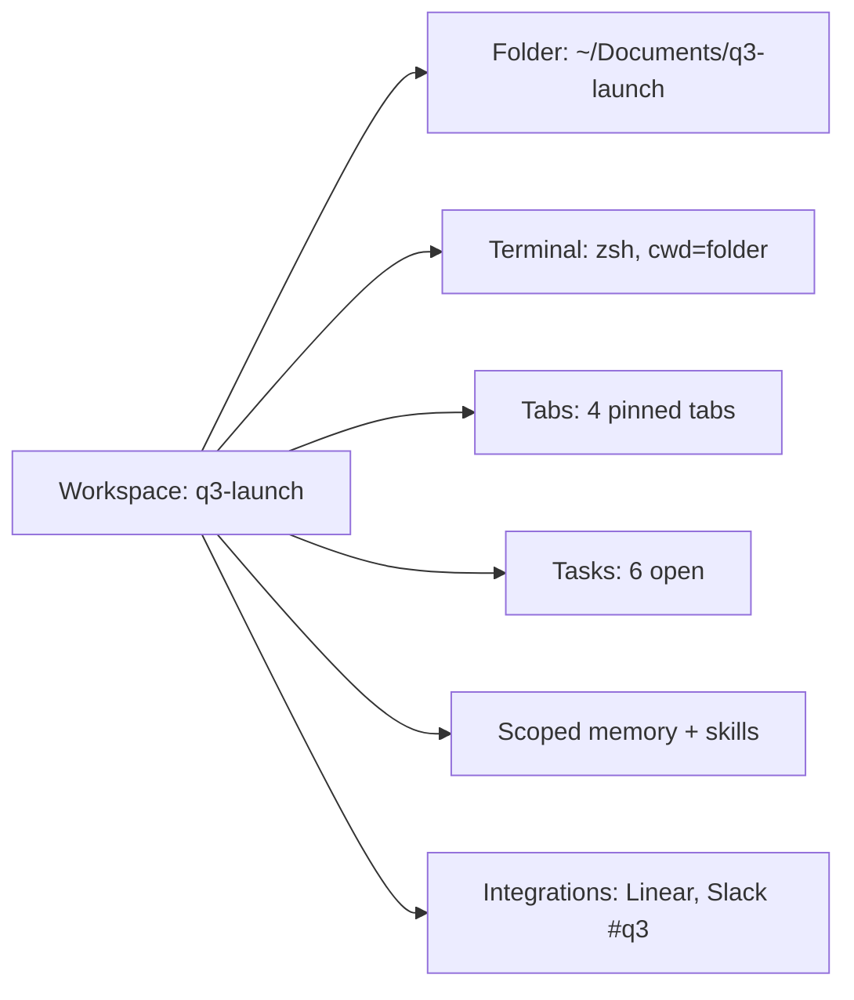

# 05 — Workspace, Files & Terminal

## Summary

Pane doesn't stop at the browser. The agent can work with your files and your terminal, inside **workspaces** you grant. A workspace is the unit of permission and context for everything outside the browser: a folder, a shell, a set of granted tools, and the related tabs/tasks/projects the Context Graph links them to. This is Pane's answer to the file+terminal half of Hermes and Claude Cowork — but integrated with the live browser session instead of isolated in a VM or daemon.

> **Review v0.2 note.** Workspace is now explicitly **the wedge surface** (with Pane-as-MCP, [09](./09-integrations-mcp-developer-surface.md)). Added: the **first-workspace magic moment** (the thesis proof for the expand ICP), **cross-platform shell (Windows)**, and a sharpened **trust bar** ("safe enough to grant on my real repo"). Removed the heavier containerized-isolation mode from v1 scope.
>
> **Review v0.3 note.** Anchored on **Cowork, which already ships in BrowserOS** — filesystem tools (`ls`/`read`/`write`/`bash`/`search`) and a folder picker. Workspaces *evolve* Cowork: add grant/switch/scope, a sandboxed terminal with denylist, and terminal/file nodes in the Context Graph. We extend the existing filesystem tools; we don't reimplement them. Workspace sync (metadata) is a State B extension point; the workspace is complete locally.

---

## Goals

- Let the agent read, write, search, and organize files in folders the user explicitly grants.
- Let the agent run shell commands in a sandboxed terminal, with approvals scaling to consequence.
- Make "workspace" the natural home for project work: files + terminal + tabs + tasks + memory together.
- Keep file/terminal access **permissioned, sandboxed, auditable** (principles 4, 7, 10).

## Non-goals

- Full VM isolation (Claude Cowork's model). Pane runs on the user's real machine; isolation is via sandboxing + approvals, not a VM.
- Replacing the user's editor or IDE. Pane complements them; harness agents (Claude Code, Cursor) handle heavy editing inside the workspace.
- Becoming a hosted cloud dev environment.

---

## Workspaces

A **workspace** is a granted scope that bundles:

| Component | Description |
|-----------|-------------|
| **Root folder** | A path on disk the user grants (e.g. `~/code/myapi`, `~/Documents/q3-launch`). Multiple folders per workspace allowed. |
| **Terminal** | A shell scoped to the workspace root, with a configured environment and toolchain. |
| **Tabs** | Browser tabs the user has associated with the workspace (pinned, grouped). |
| **Tasks** | Tasks/projects scoped to the workspace (see [06](./06-task-and-work-management.md)). |
| **Memory scope** | Workspace-scoped memory entries and skills (in addition to global memory). |
| **Integrations** | Connections relevant to the workspace (e.g. the workspace's Linear team, Slack channel). |

- **Granting** a workspace is the moment file/terminal access becomes `granted` in the Context Graph. Before that, the agent cannot touch the filesystem.
- **Switching workspaces** re-scope the agent: `context.current_work`, memory scope, and default tabs change. This mirrors how a developer switches projects in their editor.
- **Multiple workspaces** can coexist; the active one is visible in the side panel and new-tab composer.
- **Auto-suggest**: when the user repeatedly opens the same set of tabs + a folder, Pane offers to create a workspace (a nudge, dismissable).

### The first-workspace magic moment

Granting a workspace is the highest-friction step in activation — and the moment the thesis becomes real for the expand ICP. We engineer it as a moment, not a form:

1. **Suggest the obvious folder**: after Chrome import or on first Agent use, propose the user's most-active project folder (`~/code/<repo>`, `~/Documents/<project>`) pre-selected.
2. **One-click grant with a clear scope preview**: "Pane will be able to read and edit files in `~/code/myapi` and run commands there. It can't touch anything outside this folder." Show the boundary, not a settings dialog.
3. **Immediate payoff**: as soon as granted, run a tiny zero-config task that proves value — "I can see this is an Axum project with 12 tests, last failing test was `auth::tokens`. Want me to open the failing route in the browser and reproduce it?" The user feels "it knows my work" within seconds of granting.
4. **No dead ends**: if the user declines, Chat + browser-only Agent still work fully. Workspace is an upgrade, not a gate.

This moment is the single biggest lever on T2 activation (see [12](./12-onboarding-activation-metrics.md)).

---

## File tools

Built on the existing Cowork filesystem tools, refined and exposed via the Context Graph.

| Tool | Class | Behavior |
|------|-------|----------|
| `file.list` | read | List a directory within a granted root |
| `file.read` | read | Read a file (text, images, PDFs via extraction) |
| `file.write` | write-local | Create/overwrite a file (first-time confirm; free within granted roots) |
| `file.edit` | write-local | String-replace edits (precision required) |
| `file.search` | read | Full-text search within a workspace (local FTS index) |
| `file.find` | read | Find files by name/pattern |
| `file.move` / `file.delete` | write-local | Organize; first-time confirm; deletions go to a workspace trash, not permanent |
| `file.download` | write-local | Save a browser download into the workspace |
| `file.export` | write-local | Save page-as-PDF / screenshot / CSV into the workspace |

- All file nodes are indexed in the Context Graph with content (local FTS + optional embeddings).
- **Deletions are reversible** via workspace trash for N days (principle 5: reversible where possible).
- **Outside-root access** is `denied` by default; the agent can request a grant (`context.grant_request`).

---

## Terminal & system access

| Tool | Class | Behavior |
|------|-------|----------|
| `shell.run` | system | Run a command in the workspace shell. **Approval required** for commands with side effects; read-only commands (`ls`, `cat`, `git status`, `rg`) run freely once the workspace is granted. |
| `shell.session` | read | Open/inspect a long-lived shell session; read output. |
| `shell.history` | read | Search past commands in the workspace (the Context Graph stores terminal sessions). |
| `system.open` | write-local | Open a file/URL with the OS default handler. |
| `system.notify` | read | Send an OS notification. |

### Sandboxing

- The workspace shell runs with a **scoped environment**: `cwd` pinned to the workspace root, a PATH the user can configure, and an optional **allowlist/denylist** of executables.
- **Cross-platform shell**: on macOS/Linux, the user's default shell (zsh/bash) with their config inherited; on **Windows**, PowerShell + cmd, with the same scoping. The dangerous-command denylist is platform-aware (`rm -rf` on Unix, `Remove-Item -Recurse -Force` / `format` on Windows, `sudo`/`del /s` etc.). One-click "clean env" per workspace for reproducibility.
- **Dangerous commands** (anything matching a denylist, anything that writes outside the workspace root, `sudo`, system-wide installs) require approval every time and are flagged in the transcript.
- **Network egress** is unrestricted by default (the browser is already online) but can be scoped per-workspace for security-conscious users.
- **No root, no system-wide installs** without explicit, time-boxed trust pins (principle 7). `spend`-class actions (paid installs) always require approval.

### The trust bar: "safe enough to grant on my real repo"

Developers will grant a workspace on their *real* code, not a sandbox copy. The trust bar is high and explicit:

- **Read/write confined to the granted root**, enforced even through symlinks/hardlinks (resolved and blocked if they escape).
- **No secrets exfiltration**: outbound content scanning applies to terminal output the agent sends externally (e.g. via a channel) — secrets in command output are flagged.
- **Git safety**: destructive git commands (`push --force`, `reset --hard`, history rewrites) require approval; commits/branches do not.
- **Reversibility**: file deletions go to workspace trash; the action log records every terminal command for replay/undo-of-intent.
- **The promise we make to devs**: "Pane can edit your repo and run your commands, but only in the folder you picked, only with commands you can see, and never outside it without asking." We state this verbatim in onboarding.

### Sessions as graph nodes

Every terminal session is a **Terminal session** node in the Context Graph (see [02](./02-the-context-graph.md)) with commands, outputs, exit codes, and `cwd`. This lets the agent (and the user) recall "the command I ran that failed last Tuesday" and lets the learning loop extract skills from successful command sequences.

---

## Harness agents in the workspace

Pane already supports Claude Code and Codex as harness agents. In a workspace, a harness agent is:

- **Sandboxed to the workspace root** (file + terminal).
- **Driven via Pane's MCP surface**; it does not get `write-external` or `spend` approvals — Pane remains the outer authority.
- **Fed browser context** through Pane: the harness can ask Pane "open the staging admin and reproduce the bug" and Pane runs the browser loop, returning results.

This is the developer flywheel: the user's coding agent gets a real browser + real logins + the Context Graph, all provided by Pane, all in the user's session. See [09](./09-integrations-mcp-developer-surface.md).

---

## User stories

- "I'm researching competitors. I create a workspace `competitor-research`, grant `~/Documents/competitor-research`, and the agent scrapes five sites into structured notes in that folder — I didn't paste a single URL."
- "I'm fixing a bug. I open the `myapi` workspace, the agent reads the repo, runs `make test`, sees the failure, opens the failing route in the browser, and reproduces it — all in one loop."
- "I want the agent to file my expenses weekly. It reads the receipts folder, opens the expense portal (logged in as me), fills the form, and writes a summary to the workspace."
- "From Claude Code: `pane run 'open localhost:3000, click Sign up, read console errors'` — Pane returns the console output; Claude Code writes the fix."

---

## Surfacing

- **Workspace switcher** in the side panel and new-tab composer (active workspace + scoping indicator).
- **Workspace view** (`/workspace/:id`): files, terminal, tabs, tasks, memory, integrations in one place — the project home.
- **Composer grounding chips** show the active workspace and let the user attach specific files or a terminal session.
- **Terminal panel**: an in-browser terminal for the workspace (the agent's shell, usable by the user too), with command history search.

---

## Interactions with other specs

- **02 — Context Graph**: files, terminal sessions, and workspaces are graph domains; file/terminal events feed activity memory (layer 4).
- **03 — Agent Modes & The Loop**: file/terminal tools are invoked by the loop with the consequence classes above.
- **04 — Memory & Learning Loop**: command sequences and file workflows become skills; workspace-scoped memory.
- **06 — Task & Work Management**: tasks attach to workspaces; a workspace can have a default task list.
- **09 — Integrations & MCP**: harness agents and external MCP clients access the workspace via Pane-as-MCP, sandboxed.
- **10 — Trust**: the sandbox, denylists, and approval gating live here; prompt-injection defense ensures page content can't drive terminal commands without approval.

---

## Edge cases

- **Symlinks / hardlinks escaping the root**: resolved and blocked; access outside the root is denied even via links.
- **Large repos**: indexing is lazy and respects a budget; the agent can `file.find` without a full index.
- **Long-running commands** (servers, watches): run in a named session; the agent polls output; the user can attach.
- **Command needs approval but user is away** (scheduled run): pauses and posts to a channel ([08](./08-reach-and-channels.md)); never auto-approves.
- **Workspace on an external/cloud drive** (Dropbox, iCloud): supported but with a warning about sync conflicts; the agent avoids writing during sync.
- **Multiple workspaces share a folder**: stricter grant wins; the user is told.

---

## Kill criteria

- If terminal approvals are bypassed or users routinely grant "always allow dangerous commands," the sandbox is failing trust — tighten defaults before expanding capability.
- If workspace adoption is low but file/terminal use is high, workspaces are friction — consider making them implicit (auto-scoped to the active project folder).

---

## Open questions

1. **Default shell environment**: inherit the user's shell config (`~/.zshrc` / PowerShell profile) or use a clean minimal env? *Decision (v0.2): inherit by default, with a "clean env" per-workspace option for reproducibility.*
2. **How aggressive is the dangerous-command denylist**? *Decision (v0.2): ship a conservative, platform-aware list; make it per-workspace editable; log every block for review. Calibrate from block + false-positive data.*
3. ~~**Do we offer a heavier isolation mode** (containerized workspace)?~~ *Decision (v0.2): deferred from v1; sandbox + approval is the answer. Containerized isolation is a later opt-in for high-security users.*
4. **Workspace sync**: should workspaces sync to cloud (so tabs/tasks/files-meta follow the user) while file *contents* stay local? *Lean: yes, metadata sync opt-in; content sync is a separate explicit opt-in.*

---

## Metrics

- **Workspace grant rate** (% of users who create ≥1 workspace in 7 days).
- **Files touched per workspace** and **terminal commands per workspace** (engagement).
- **Approval grant rate** for `system` actions vs. deny rate (calibration).
- **Dangerous-command blocks** (security signal) and false-positive reports.
- **Harness-agent sessions per workspace** (developer flywheel health).
- **Skill extraction from terminal/file workflows** (layer 4 paying off).
