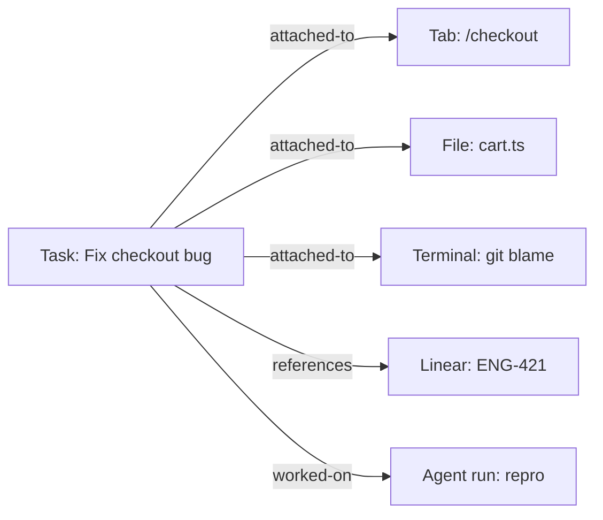

# 06 — Task & Work Management

## Summary

Pane manages your work, not just your browser. This spec defines the task layer: how the agent captures, organizes, tracks, and closes work items — tasks, projects, follow-ups, and an inbox — and how those items pull in relevant context from the Context Graph so each task carries its own situation with it. This is the "manage tasks and work" part of the thesis, and the surface that turns Pane from an assistant you ask things into an assistant that helps you stay on top of things.

---

## Goals

- Give the user (and the agent) a lightweight, native system for capturing and tracking work.
- Make every task **self-contextual**: it knows the tabs, files, terminal sessions, emails, tickets, and past agent runs that belong to it, pulled from the Context Graph.
- Let the agent triage, prioritize, and act on tasks proactively (with the user in control).
- Integrate with external task systems (Linear, Jira, Asana, Notion, GitHub Issues) instead of replacing them — Pane is the unified view, not another silo.

## Non-goals

- Building a full project-management product (Gantt, burndown, resource allocation). Pane's task model is personal, not team-PM.
- Replacing Linear/Jira. We sync and surface them.
- Becoming a CRM.

---

## The model

| Entity | Description |
|---------|-------------|
| **Task** | A unit of work: title, status, priority, due, assignee (you or the agent), links, notes. |
| **Project** | A grouping of tasks + a workspace + related tabs/files/integrations. |
| **Follow-up** | A time- or condition-bound task ("remind me to check this when the PR is merged"). |
| **Inbox** | The capture-all bucket for unsorted tasks and things the agent thinks you should decide on. |
| **Agent run (linked)** | A recorded agent execution attached to a task (see [03](./03-agent-modes-and-the-loop.md)). |

Statuses: `inbox`, `todo`, `in_progress`, `blocked`, `done`, `cancelled`. Priorities: `low`, `normal`, `high`, `urgent`.

---

## Self-contextual tasks

A task's **context** is the set of Context Graph nodes linked to it via edges (see [02](./02-the-context-graph.md)):

- Tabs/pages the task is about
- Files in a workspace the task touches
- Terminal sessions relevant to it
- App objects (the Linear issue, the email thread, the Slack message) it originated from
- Past agent runs done for it
- Memory entries and skills relevant to it

**Auto-attachment**: when the user works on a task (active task set in the side panel), Pane silently attaches nodes the user or agent interacts with to that task — tabs opened, files edited, commands run. This is the "the task knows its own situation" property, and it's only possible because Pane is the browser. The user can detach anything.

---

## Capture

Tasks enter the system many ways:

| Source | How |
|--------|-----|
| **User composer** | "Add a task: …" or `⌘N` quick-add. Natural language → parsed task. |
| **From a page** | Right-click / action menu on any page: "Create task from this page" (page auto-attached). |
| **From a message** | An email or Slack message → "Create follow-up" (the message node auto-attached). |
| **Agent-suggested** | The agent proposes a task or follow-up from a conversation or activity pattern; lands in Inbox pending confirm. |
| **Proactive detection** | The agent detects an actionable commitment ("I'll send the brief by Friday") and proposes a follow-up. |
| **External sync** | Linear/Jira/GitHub issues you own sync into the task list (two-way for status where supported). |

Quick capture is < 3 seconds and never forces the user to fill metadata.

---

## Triage & the inbox

The **Inbox** is the single place to decide what happens to new items:

- **Do it now** (agent does it, if small)
- **Turn into a task** (assign to a project, set due)
- **Delegate to the agent** (becomes an agent-owned task that runs later/scheduled)
- **Snooze** (resurfaces at a chosen time or condition)
- **Dismiss**

The agent offers a **daily triage digest**: "Here are 4 new items, here's what I think you should do, want me to handle the small ones?" This digest can run as a scheduled task ([07](./07-proactive-and-scheduled-work.md)) and be delivered via a channel ([08](./08-reach-and-channels.md)).

---

## The agent as a task executor

Tasks can be **assigned to the agent**. An agent-owned task:

- Has a description the agent can execute as an Agent-mode run.
- May be **scheduled** (run daily, on a trigger) — see [07](./07-proactive-and-scheduled-work.md).
- Runs with the task's context attached automatically.
- Reports back via the transcript + a channel notification + an inbox update.
- Respects all approval rules (consequential actions still gate).

This is the bridge between "task list" and "automated work": a task isn't just a reminder, it's an executable the agent can run.

---

## External task system integration

- **Linear, Jira, Asana, GitHub Issues, Notion**: via Connect Apps (see [09](./09-integrations-mcp-developer-surface.md)).
- **Sync rules**: which team/project, which statuses map to which, two-way or one-way, per integration.
- **Pane as the unified view**: the task list shows native + synced tasks together, with provenance ("from Linear ENG-421").
- **Acting on external tasks**: the agent can comment, update status, or create issues in the external system — `write-external`, approval-gated.

We do not force a choice between "use Pane's tasks" and "use Linear." Pane is the layer on top.

> **Review v0.2 note.** Pane's tasks compete on being **executable** and **self-contextual**, not on PM UI. **Native kanban/board/calendar views are cut from v1** — list + inbox only. The differentiator is "a task the agent can run," not "another task list." Two-way creation in Pane→external is a fast-follow, not v1.
>
> **Review v0.3 note.** Tasks are a net-new intrinsic surface (BrowserOS has no task layer today), built on the Context Graph and the existing scheduled-tasks runtime. External task sync (Linear/Jira/...) uses Connect Apps (Klavis — third-party server, State A compatible). Task sync to Pane's own cloud is a State B extension point; the task store is complete locally.

---

## Surfacing

- **Tasks sidebar** (`/tasks`): **list view only in v1** (filter by project/status/assignee). Board (kanban) and calendar views are deferred — they're PM-tool table stakes and not where Pane differentiates.
- **Active task indicator** in the side panel: shows the task you're currently working on; everything you do auto-attaches to it.
- **Inbox** (`/inbox`): the triage surface.
- **Daily digest** (in-app and via channels): morning summary of what's due, what's blocked, what the agent handled overnight.
- **Task chips** in the composer: attach the current task to an agent run.

---

## User stories

- "I'm reading an email that says 'can you look into the billing bug?' I hit `⌘N` → it becomes a task with the email attached. I assign it to the agent for tomorrow morning."
- "I set 'Fix checkout bug' as my active task. I open the checkout page, edit `cart.ts`, run the tests — all auto-attached. Tomorrow I resume and the task still knows everything."
- "Every morning Pane sends me a Telegram digest: 3 things due, 1 blocked, it handled 2 small tasks overnight, and it needs my approval on one Slack post."
- "My Linear issues show up in Pane's task list. When Pane fixes one, it updates Linear and comments with what it did."

---

## Interactions with other specs

- **02 — Context Graph**: tasks/projects are graph nodes; auto-attachment uses edges.
- **03 — Agent Modes & The Loop**: agent-owned tasks execute as Agent runs with task context attached.
- **04 — Memory & Learning Loop**: recurring task patterns become skills; task history is searchable via session archive.
- **05 — Workspace, Files & Terminal**: a project links a workspace; file/terminal activity attaches to active tasks.
- **07 — Proactive & Scheduled Work**: the daily digest and agent-owned scheduled tasks live there.
- **08 — Reach & Channels**: digests and triage prompts delivered out-of-browser.
- **09 — Integrations & MCP**: external task systems sync via Connect Apps; tasks exposed to MCP clients.
- **10 — Trust**: agent-owned tasks that take consequential actions still gate on approval.

---

## Edge cases

- **Sync conflicts** (status changed in both Pane and Linear): last-writer-wins with a recorded conflict the user can resolve; never silent data loss.
- **Task with no context** (capture-only): fine; the agent can work on it but may ask for context.
- **Delegated task fails**: the agent reports failure to the inbox + a channel, never silently gives up.
- **Over-attachment** (active task attaches too much): the user can prune; we attach only nodes with strong signal (the tab they focused, the file they edited).
- **Privacy of synced tasks**: external task content follows the external system's trust model; Pane marks it as `provenance: external` and excludes it from memory writes by default.

---

## Kill criteria

- If the vast majority of users keep their tasks in Linear/Jira and never use Pane's native tasks, we over-built. *Decision (v0.2): ship list + inbox + executable tasks only; no native projects/kanban in v1. If even the list sees low use, fall back to **inbox + agent-owned tasks + external sync** only.*
- If the daily digest is ignored/disabled >50%, the triage framing is wrong — rework before adding features.

---

## Open questions

1. ~~**Native kanban/board or list-only v1?**~~ **Decision (v0.2): list-only.** Pane differentiates on executable, self-contextual tasks, not on board UI.
2. ~~**Two-way sync with Linear/Jira in v1** or read-mostly?~~ **Decision (v0.2): v1 is status + comments two-way; creation in Pane→external is a fast-follow.**
3. **Should agent-owned tasks be allowed to run `write-external` without per-run approval** if the user pre-authorized the task? *Lean: no — pre-authorize a (connection, action) pin, but each new kind of action still confirms once.*
4. **Do tasks sync to cloud** by default? *Lean: opt-in with cloud sync; tasks are user-created data and follow the sync setting.*

---

## Metrics

- **Tasks created per user** (native + synced) and **inbox → resolved** rate.
- **Active-task usage** (% of sessions with an active task set) — the core "self-contextual work" behavior.
- **Agent-owned task execution rate** and success rate.
- **Daily digest engagement** (open/act/ignore).
- **External sync attach rate** (Linear/Jira users who connect).
- **Time-to-capture** (how fast a task goes from "I should do this" to in the system).
