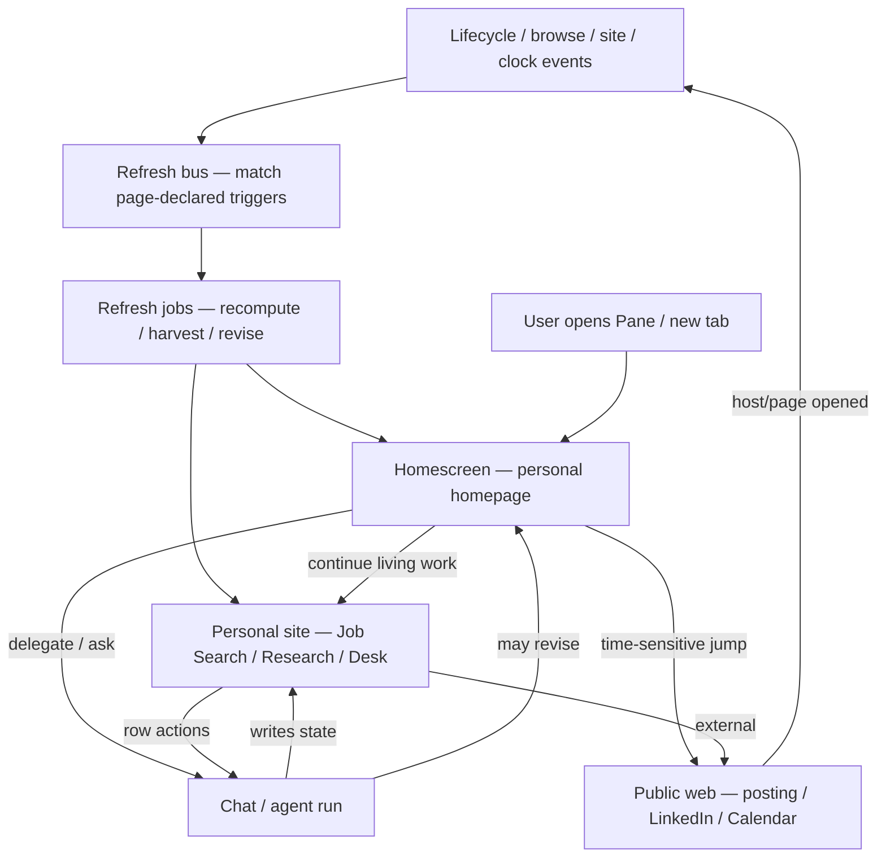

# 19 — Homescreen of the Personalised Internet

**Status:** product deep dive / handoff for Personalised Internet work  
**Audience:** agent (or human) building Personalised Internet  
**Scope:** the **homescreen only** — how new-tab home becomes the front door of a private web that grows with the user, including how **page-declared refresh triggers** keep home and personal pages current.  
**Out of scope here:** personal-site use-case catalog, element DSL, token budgets, storage/routing of internal sites (owned by [20 — Personalised Internet](./20-personalised-internet.md)). Assume that plan’s framing is already known.

**Relationship to existing specs:**
- Reframes [15 — Adaptive Home](./15-adaptive-home.md) from “collection of ranked widgets” → “evolving personal homepage.”
- Sits beside [20 — Personalised Internet](./20-personalised-internet.md) (private sites for living work) and [16 — Page reshape](./16-page-reshape-and-overlays.md) (overlays on the public web).
- Does **not** use context buckets as a product concept.

---

## 1. The reframe in one sentence

The homescreen is not a widget dashboard. It is the **homepage of the user’s Personalised Internet** — a single page that Pane authors and continuously revises so opening Pane feels like opening *their* web, not a chrome with agent status cards.

Widgets (as shipped today) were a useful prototype of “show local state at a glance.” They are the wrong end-state. The end-state is a **composed, evolving page**: continuity for today, doorways into living personal sites, and only as much structure as the user’s real work has earned.

---

## 2. Surface map (so home doesn’t steal personal-site jobs)

| Surface | Owns | User job | Density |
| --- | --- | --- | --- |
| **Chat** | Conversation, one-shots, narration | “Tell me / do this once” | Turn-based |
| **Workspace files** | Durable raw docs/data | “Store and edit” | Document |
| **Personal sites** (Personalised Internet) | Operable apps for living work | “Run my pipeline / research hub / desk” | Full app (index → detail → actions) |
| **Homescreen** (this doc) | Front door + daily continuity | “Orient me; get me into the right place; show what changed” | One page, glance → click-through |
| **Page reshape** | Overlays on *their* sites | “Make the public web about me” | On foreign pages |

**Split of labor (non-negotiable):**

- **Personal sites** own depth: boards, entity pages, repeated row actions, multi-day operable state.
- **Homescreen** owns arrival: what matters *now*, what’s in motion, where to go next on *your* private web (and sometimes the public web).
- Home **must not** become a second Job Search board. It **should** say “Job Search — 3 interviews this week” and open the site.
- Home **must not** dump memory/agent internals. It **should** feel personally true.

---

## 3. Why “evolving webpage” beats “widget collection”

### What widget-home got right
- Local, fast open (no LLM at tab-open).
- Pin / hide / dismiss preferences.
- Idea that the surface should change with the user’s life.
- Hook points for approvals, resume, recurring work.

### What widget-home got wrong (observed)
- Cards that exist because a *subsystem* has data, not because the *user* has a job.
- Digest as an unstructured blob (memory paste, “N background actions”).
- Inbox tasks rendered as approve/deny (wrong product object).
- Empty or meaningless actions training the user to ignore the home.
- Gallery of custom widgets before a strong default page exists.
- Feels like an agent status board, not a personal homepage.

### What “full page that evolves” means
- **One composition**, not a grid of equal cards competing for attention.
- **Sections earn their place** from the user’s living work and today’s continuity — they appear, grow, shrink, and disappear as work appears and ends.
- **Doorways into personal sites** are first-class, not an afterthought footer.
- **Evolution is authorial**: Pane rewrites the homepage over days/weeks the way it maintains a personal site — prefer update over recreate, same address, growing truth.
- **Empty is calm**: if nothing is in motion, home is quiet (composer + light orientation), not fake furniture.

This is the same product instinct as Personalised Internet (“living tools, not pretty reports”), applied to the *front door*.

---

## 4. Jobs the homescreen must do

Primary JTBD:

> When I open Pane, give me a **homepage that already knows my ongoing work and my day**, so I can orient and enter the right place — without rebuilding context from chat history or bouncing across apps first.

Secondary jobs:

1. **Orient** — what needs awareness right now (without requiring a click to get value).
2. **Enter living work** — one click into the personal site that owns the campaign (Job Search, Research hub, …).
3. **Continue unfinished context** — resume the thread of browsing/work Pane already saw.
4. **Surface time-bounded moments** — next meeting / interview with enough context to act.
5. **Hand off to the agent** — scoped “handle this” from something already on the page (not a blank chat).
6. **Stay honest** — show freshness; never fake structured data or dead controls.

Non-jobs (push elsewhere):

- Full pipeline / CRM / research board operations → personal sites.
- Long-form answers → chat.
- Decorating LinkedIn/Greenhouse pages → page reshape.
- Representing every Pane subsystem on screen → nowhere (kill criteria).

---

## 5. Habit thesis (why this makes Pane first-open)

People do not open Chrome for widgets. They open it because work already lives in the browser.

Pane becomes first-open when the homescreen **collapses the first minutes of daily orientation** and **keeps an address for campaigns that span days**:

- Morning: what’s next, what’s stuck, which personal sites are hot, what Pane prepared overnight.
- Mid-day: return to the same homepage; it has shifted with the day, not reset.
- Multi-week: Job Search (or Research, or Desk) remains one click from home — the private web has a front door.

**Success signal:** after two weeks, opening a stock browser feels slightly lost — the user’s work had an address on Pane’s homepage and deeper private sites.

**Failure signal:** user hides home content / jumps straight past it to chat or external sites every time (same kill instinct as [15](./15-adaptive-home.md)’s hide-rate criterion).

---

## 6. Information architecture of the homepage

Think **regions of a personal webpage**, not widget types. Names are product language; implementation can still be composed modules.

### 6.1 Always-on chrome (stable)
- Pane identity / greeting that feels personal, not generic SaaS.
- Chat composer (home surrounds chat; it does not replace it — same as [15](./15-adaptive-home.md)).
- Way to list / open personal sites (“My sites” / library) without cluttering the first viewport.

### 6.2 Continuity band (today)
Content that answers “what should I know or do *now*?”

Examples of *earned* blocks (only if true):
- Next time-bounded event + one line of prep context.
- Things waiting on the user that block progress (real approvals; aging follow-ups Pane knows about).
- “Prepared for you” outputs from proactive runs (shortlist, draft follow-ups) — outcomes, not cron logs.
- Unfinished work Pane can restore (tabs/thread), when it is actually useful.

Anti-examples (do not ship as default furniture):
- Raw memory bullet dumps (“Notes about you”).
- “N background actions recorded.”
- Approve/Deny rows with no preview / no tokens.
- Empty metric cards.

### 6.3 Living work doorways (campaigns)
The homepage’s link into Personalised Internet.

Each doorway is a **projection** of a personal site, not the site itself:

- Title of the site (Job Search).
- One-line pulse (“3 interviewing · 2 need follow-up · last updated 2h ago”).
- Primary enter action → open the site.
- Optional secondary: one high-value next step that deep-links into a row/page or starts a scoped agent task.

**Rule:** if a personal site exists and is active, it deserves a doorway when it has pulse. If the site is dormant, demote or hide the doorway (same curation discipline as [15](./15-adaptive-home.md): useful or gone).

### 6.4 Ritual / agency strip (optional, sparse)
Rare, high-confidence one-shots: run a routine Pane has proven the user wants; open a monitor that refreshed overnight. Never a junk drawer of skills.

### 6.5 Day-one / empty state
No living sites yet, thin graph: calm page + composer + honest starters (“Start a job search pipeline”, “Build a research hub”) that **create personal sites**, not fake widgets. Aligns with Personalised Internet decision rule: pages for living work only.

---

## 7. Evolution model — how the homepage grows

The homepage is itself a **maintained personal page** with a special role (front door). Evolution rules:

1. **Prefer update over recreate** — same home address; Pane revises sections as work changes.
2. **Spawn from living work** — when a personal site is created (e.g. Job Search), home gains a doorway; when the site dies or is archived, doorway goes.
3. **Promote from rhythm** — if the user repeatedly returns to a site or asks for the same morning brief, home strengthens that region (not by piling cards).
4. **Demote from neglect** — regions never entered / never useful fade with undo (curation, not clutter).
5. **User authorship** — pin, hide, “don’t show this”, “make this bigger” feed preferences (today: `USER.md` home prefs; keep the spirit).
6. **Agent authorship** — Pane may propose homepage changes (“Add Job Search to your home?”) the way it proposes personal sites; auto-clutter is forbidden.
7. **One homepage per profile** — not fifty mini-homes. Depth lives in personal sites.

**Continuously grows** means the *private web* grows (more sites, richer pages) and the *homepage* stays a curated front door into that web plus today’s continuity — not an ever-longer dashboard.

---

## 8. Context layer (homescreen-specific)

Personalised Internet will own how site pages get entity state. Homescreen needs a clear **read model** so the front door stays fast and true.

### 8.1 Constraint
Tab-open stays cheap and local: **render from snapshots**, never live-scrape Gmail/Calendar/LinkedIn on every new tab.

### 8.2 Sources the homepage may project

| Source class | Examples for home | Freshness |
| --- | --- | --- |
| **Personal site projections** | Pipeline pulse, “needs follow-up” counts, next interview on Job Search | Updated when the site/agent mutates site state |
| **Native Pane state** | Approvals waiting, resume-able work, meeting capture, scheduled outputs | Continuous / on event while Pane runs |
| **Connected structured sync** (when product enables) | Next calendar events | Background sync → local cache |
| **Harvested webapp records** (when product enables) | Aging unreplied messages Pane was asked to watch | Scheduled/triggered harvest → local cache → home only shows *interpreted* obligations, not feeds |

### 8.3 Context store contract (product, not schema)
Every block on the homepage should be explainable as:

- **Projection** of named records (with ids that actions can bind to).
- **Provenance** (which site / sync / harvest).
- **Stale-at** timestamp (UI may show “as of …”).
- **Eligibility** (hide when empty or too stale).

Custom “widgets” in the old Phase-8 sense should be reabsorbed as either:
- a **doorway/projection** of a personal site, or
- a **homepage section** backed by the same refresh pipeline — not a third parallel gadget system.

### 8.4 Unstructured → home-worthy
Feeds (tweets, LinkedIn posts, inbox) do **not** belong on the homepage as streams. Home-worthy outputs are **interpreted**:

- obligations (“reply to X”, “follow up on Y”),
- time bounds (“interview in 25m”),
- campaign pulses (“2 new roles match your search criteria — open Job Search”).

Interpretation runs **off the render path** (proactive / harvest / site maintenance). Home only displays results.

### 8.5 What home should not read directly
- Raw memory layers as a bio dump.
- Agent run logs / tool traces as primary UI.
- Live DOM of arbitrary sites at tab-open.

### 8.6 Freshness without live fetch
Snapshots only stay trustworthy if something **refreshes them on the right moments**. That is not “poll harder on tab-open.” It is a **page-declared trigger system** shared by the homepage and personal sites — see §9.

---

## 9. Refresh hooks — how the private web stays alive

Snapshots make tab-open fast. **Triggers** make snapshots true.

Without hooks, Personalised Internet and the homescreen rot: Job Search pulse lies, meeting prep is yesterday’s, LinkedIn obligations only update if the user re-asks. With hooks, each page (home region or personal site/page) declares **when it wants to wake up** and **what kind of refresh it needs**.

This extends the spirit of [07 — Proactive & Scheduled Work](./07-proactive-and-scheduled-work.md) (scheduled + graph-triggered agent runs), but is a **page maintenance** concern first: many refreshes are cheaper than a full user-facing “scheduled task,” and they are owned by the page that needs the data.

### 9.1 Product object: page refresh policy

Every maintainable surface in the private web — **homepage**, **site index**, **entity page** — may carry a refresh policy:

| Field (product-level) | Meaning |
| --- | --- |
| **Triggers** | Which events cause a wake-up (see catalog below) |
| **Refresh kind** | How expensive / what runs (see kinds below) |
| **Scope** | What to refresh (this page only, site pulse, named projections, linked entity pages) |
| **Guards** | Cooldown, quiet hours, battery, max concurrent, require Pane in foreground / require host tab available |
| **On failure** | Keep last good snapshot; mark stale-at; optional nudge — never blank the page into emptiness without honesty |

**Default:** pages without an explicit policy still refresh on **write paths** (user/agent mutated the site) and on **home open catch-up** for cheap recompute only. Harvest/sync triggers are opt-in per page so we do not scrape the web on every lifecycle blip.

### 9.2 Trigger catalog (examples pages may subscribe to)

Group by how Pane learns the event. Pages subscribe by name + optional filter (host, site id, meeting id).

| Class | Example triggers | Typical use |
| --- | --- | --- |
| **Clock / calendar** | `new-day` (local tz), `digest-hour`, `pre-event` (N min before calendar/meeting), `interval` (e.g. every 6h) | Morning homepage continuity; interview prep warm-up; monitors |
| **Browser lifecycle** | `browser-started`, `profile-unlocked`, `return-from-sleep` / catch-up, `home-focused` | Catch-up after laptop closed; light recompute when user lands on home |
| **Meeting / capture** | `meeting-started`, `meeting-ended`, `transcript-ready` | Meeting notes page; home “last meeting” / follow-up doorway; desk open loops |
| **Personal site lifecycle** | `site-created`, `site-updated`, `entity-mutated`, `site-archived` | Home doorway pulse; dependent pages (company brief after pipeline stage change) |
| **Agent / job lifecycle** | `run-completed`, `approval-resolved`, `scheduled-job-finished`, `harvest-finished` | Show “prepared for you”; unlock blocked UI; refresh after overnight scan |
| **Browse / host** | `host-opened` (e.g. `linkedin.com`), `host-closed` / session idle, `url-matched` (jobs page pattern) | Opportunity to harvest while the real session is warm; do **not** mean “embed LinkedIn on home” |
| **Graph / work signals** | `task-stale`, `no-progress`, `current-work-shifted` | Continuity band; nudge to reopen a site |
| **Integration sync** (when enabled) | `calendar-changed`, `mail-matched` | Next-event band; obligation radar |
| **User explicit** | `manual-refresh`, `pull-to-refresh` | Always available; respects same refresh kind + guards |

**Filters matter.** `host-opened: linkedin.com` on the Job Search site is right; the same trigger on every page would thrash. `meeting-ended` should target the desk / that meeting’s prep page, not rewrite the whole private web.

### 9.3 Refresh kinds (cheapest first)

Not every trigger should start an agent.

| Kind | What runs | Cost | When to use |
| --- | --- | --- | --- |
| **A. Reproject** | Re-read local site state / context store → rewrite pulse & page projections | Cheap, no LLM | After `entity-mutated`, `approval-resolved`, most home doorway updates |
| **B. Sync** | Pull structured API/MCP (calendar, etc.) into store → reproject | Network, no browse | Calendar-backed continuity |
| **C. Harvest** | Agent uses real browser session to visit a host/page, extract, write store → reproject | High (session + model) | LinkedIn messages, sites without API; prefer when `host-opened` or scheduled off-peak |
| **D. Revise** | Agent updates page composition / copy / structure (homepage region rewrite, add section, archive doorway) | High | `new-day` homepage authorship; site grew enough that IA should change |
| **E. Full task** | User-visible scheduled/triggered job per [07](./07-proactive-and-scheduled-work.md) (may notify) | Highest | Weekly competitor scan that *produces* artifacts the page then shows |

**Rule of thumb:** homepage open → prefer **A** (and catch-up **B** if calendar sync is stale). **C/D** run on triggers in the background; home only *displays* results. **E** is for jobs the user would recognize as “a task Pane ran,” not silent pixel maintenance.

### 9.4 Who declares triggers?

| Surface | Who authors the policy | Example |
| --- | --- | --- |
| **Homepage** | Pane default policy + user prefs; agent may propose additions as home evolves | Default: `new-day` → revise continuity; `site-updated` → reproject doorways; `browser-started` → catch-up reproject; `meeting-ended` → follow-up callout if desk/site cares |
| **Personal site (index)** | Declared when the site is created/maintained (template + agent) | Job Search: `new-day` reproject; `host-opened:linkedin.com` harvest messages/roles; `entity-mutated` reproject; `pre-event` warm interview pages |
| **Entity page** | Inherited from site + page-specific | Company page: refresh when that row is researched; interview prep: `pre-event` + `meeting-ended` |
| **User / agent** | “Keep this current when I open LinkedIn” becomes a trigger on that site, not a one-off chat | Same vocabulary as save-as-scheduled, but bound to a page |

**Page-defined triggers are the default customization path** — more important than a freeform home widget gallery. The agent’s job when creating Job Search includes attaching a sensible refresh policy, not only drawing a board.

### 9.5 Deduping, storms, and honesty

Triggers will fan out (one LinkedIn open should not wake twelve pages). Product rules:

1. **Coalesce** — same page + same refresh kind within cooldown → one run.
2. **Priority** — user-visible time bounds (`pre-event`) beat opportunistic harvest (`host-opened`).
3. **Session affinity** — harvest kinds that need login prefer firing when the host tab is already open; otherwise schedule catch-up or skip with stale-at.
4. **Battery / quiet hours** — harvest/revise defer; cheap reproject may still run (align with [07](./07-proactive-and-scheduled-work.md) battery/quiet patterns).
5. **Catch-up on `browser-started`** — replay missed clock triggers (e.g. `new-day`) once; don’t replay every historical `host-opened`.
6. **Stale UI** — if a trigger failed or was skipped, projections keep last good data and expose `stale-at` / “as of …”. Lying that data is live is worse than looking slightly old.
7. **Visibility** — optional “last refreshed” on doorway; maintenance runs are not a second agent chat spam unless kind **E** or approval is needed.

### 9.6 Relation to scheduled tasks & graph triggers ([07](./07-proactive-and-scheduled-work.md))

| Concept | Owns | Output |
| --- | --- | --- |
| **Page refresh policy** | Keeping a private page / home projection true | Updated snapshots / optional page revise |
| **Scheduled / triggered task** | User- or agent-owned jobs that *do work in the world* or produce artifacts | Run record, notifications, approvals |
| **Proactive nudge** | Suggestion without necessarily mutating a page | Offer card |

They compose: a weekly Job Search scan can be a **scheduled task (E)** whose `run-completed` trigger causes Job Search + home to **reproject (A)**. A `host-opened:linkedin.com` harvest can be **only** a page refresh (C) with no Scheduled Tasks row — unless the user promoted it to a named job.

Do not force every page refresh into the Scheduled Tasks UI. Do expose enough inspectability (“Job Search refreshes when LinkedIn opens”) so trust stays intact ([10](./10-trust-privacy-security.md) spirit).

### 9.7 Homescreen-specific default policy (starting point)

Bias for the front door — revise with evidence:

| Trigger | Refresh kind | Scope |
| --- | --- | --- |
| `browser-started` / catch-up | A (+ B if calendar connected and stale) | Continuity band + all doorway pulses |
| `new-day` | D (light) or A if nothing to say | Continuity band authorship; demote dead doorways |
| `home-focused` | A only if stale older than N minutes | Doorways + continuity |
| `site-updated` / `entity-mutated` | A | That site’s doorway (+ continuity callouts that reference it) |
| `meeting-ended` / `transcript-ready` | A, maybe D | Continuity follow-up; link into meeting/desk site if present |
| `run-completed` (proactive outputs) | A | “Prepared for you” |
| `pre-event` | A | Next-event band |
| `host-opened:*` | **Not on home by default** | Belongs on the personal site that cares; home learns via `site-updated` after harvest |

Home should rarely harvest. Home **consumes** site and sync projections that harvests already wrote.

### 9.8 Hero examples (triggers in the Job Search loop)

1. User creates Job Search → site policy includes `new-day` + `host-opened:linkedin.com` (harvest) + `entity-mutated` (reproject). Home auto-gets doorway; home policy listens to `site-updated`.
2. User opens LinkedIn → Job Search harvest runs (guarded) → pipeline/messages projections update → `site-updated` → home doorway pulse updates before the user even opens home.
3. Interview tomorrow 10:00 → `pre-event` warms interview-prep page; home continuity shows doorway into that prep page.
4. Meeting ends → `meeting-ended` → prep/desk page captures follow-ups; home shows one open loop if still unresolved next morning (`new-day`).
5. Laptop closed overnight → `browser-started` catch-up runs `new-day` once → home continuity recomputed from store; LinkedIn harvest waits until LinkedIn is opened or a scheduled off-peak window.

---

## 10. Engagement layer (beyond buttons)

Value on the homepage is mostly **absorb + enter**. Clicks amplify; they are not the only product.

### 10.1 Engagement modes

| Mode | User intent | Homescreen expression |
| --- | --- | --- |
| **Absorb** | Orient | Pulse lines, next-event context, “prepared for you” — value with zero click |
| **Enter** | Go to living work | Open personal site / deep-link to entity page |
| **Continue** | Resume | Restore unfinished context Pane knows |
| **Decide** | Unblock | Real approve/deny for consequential agent pauses only |
| **Delegate** | “Handle this” | Scoped agent intent with bound entity/context; progress visible; trust gate unchanged |
| **Ritualize** | Make recurring | Promote a useful behavior into schedule / **page refresh trigger** / site maintenance |

### 10.2 Action vocabulary on home (keep small)
1. **Open internal** — personal site or site subpage.
2. **Open external** — real URL.
3. **Local deterministic** — dismiss, pin, mark done on Pane-native tasks, expand, manual refresh.
4. **Scoped agent call** — same model as personal-site row actions: button carries identity + intent; page/home updates on success.

**Approve/deny:** keep for trust-gated consequential runs. Do **not** use as the pattern for inbox tasks or generic work items. If nothing is awaiting approval, show nothing.

### 10.3 Custom / dynamic actions
Homescreen should not grow a scripting platform. Dynamic work = **agent intent + bound records** (same as Personalised Internet § action model). Homepage sections and personal sites share that vocabulary so the private web feels one product.

---

## 11. Relationship to Personalised Internet (integration contract)

For the Personalised Internet agent — what home needs from sites, and what home provides back:

### Home needs from personal sites
- Stable **site identity** (name, address, job-to-be-done).
- A small **pulse projection** API (product-level): stage counts, next actions due, last updated, top 1–3 urgencies.
- Ability to **deep-link** into index or entity pages.
- Lifecycle signals: created / updated / archived → home doorways appear / refresh / go.
- Per-site (and per-page) **refresh policy**: declared triggers + refresh kind + guards, so harvest/reproject is owned by the page that needs it — home mostly listens to `site-updated` rather than scraping.

### Home provides to personal sites
- **Discovery / reopen path** — the reason users find the site again without re-prompting.
- **Promotion surface** — “Pane created Job Search; add to home?” / auto-add when decision rule says living work.
- **Daily continuity** that sends traffic into sites at the right moment.
- **Shared refresh bus** — lifecycle/browse/clock events fan out to page policies (home + sites), with coalesce/guards.

### Shared principles (align with Personalised Internet plan)
- Living work only; no page/home spam for one-shot answers.
- Prefer update over recreate.
- Page/site is UI source of truth for that work; home shows projections, not a second database.
- Actions are scoped tasks; trust gate still wraps real-world side effects.
- Cheap to spawn and maintain — if home/site updates are slow or stale, users abandon the private web.
- **Pages declare when they wake** — refresh triggers are part of the page, not a global scrape-everything cron.

### Explicit non-overlap
- Do not rebuild Pipeline / Research hub / Lead board **on** the homescreen.
- Do not make the homescreen a generic dashboard builder.
- Old “custom home widgets” gallery should not compete with personal sites; fold into site doorways + homepage revision.
- Do not put opportunistic `host-opened` harvests on the homepage by default; attach them to the site that owns that host relationship.

---

## 12. Hero storyboard (homescreen lens only)

Using Job Search as the Personalised Internet hero — what the **homepage** does across time:

1. **Before any site:** calm home + composer. User asks to maintain job search → agent creates **Job Search** personal site (per PI plan) **with a refresh policy**. Home gains a Job Search doorway with empty/honest pulse.
2. **After first session:** doorway shows real pulse (“8 applied · 2 interviewing”). Continuity band may show one next action pulled from the site (“Follow up: Databricks”). Enter opens the board; it does not duplicate it.
3. **LinkedIn opened mid-day:** Job Search `host-opened` harvest runs → site state updates → home doorway pulse updates via `site-updated` without the user opening home yet.
4. **Morning later that week (`new-day`):** continuity band includes tomorrow’s interview + link into interview-prep **page on the site** (`pre-event` may have warmed it). Absorb works before coffee; Enter goes to prep pack.
5. **Meeting ended:** follow-up lands on desk/site; next `new-day` / home focus surfaces the open loop if still unresolved.
6. **After days away (`browser-started` catch-up):** same homepage address; Job Search doorway still there; pulse reflects updates; missed `new-day` ran once. User does not re-explain the pipeline in chat.
7. **When search ends / archived:** doorway demotes or disappears; site triggers disable or sleep; home gets quieter.

Sales/leads and research hubs follow the same homepage pattern: **pulse doorway + occasional continuity callouts**, depth on the site, **triggers on the site**.

---

## 13. What to retire or demote from current Adaptive Home

When implementing this reframe, treat these as debt — not sacred:

| Current | Verdict |
| --- | --- |
| Daily digest as markdown blob on home | Replace with continuity band compiled from projections + proactive outputs; no memory wall; driven by `new-day` / catch-up triggers |
| Inbox tasks via approve/deny template | Split: real approvals only for trust; tasks either live on a personal site or as simple continue/done — never fake approvals |
| Equal-weight widget grid | Replace with composed homepage regions |
| Phase-8 widget gallery as primary customization | Subordinate to personal sites + homepage evolution + **page refresh policies** |
| “Notes about you” on home | Keep in memory; do not present as homepage content |
| Showing widgets with empty/meaningless payloads | Hide; empty calm is better |

Keep: fast local render, prefs, approvals as trust UI, resume when real, composer on home, curation/demotion instincts.

---

## 14. Product principles (homescreen)

1. **Homepage, not dashboard** — one composition that feels authored for this user.
2. **Front door to the private web** — doorways into personal sites are core, not chrome.
3. **Depth lives elsewhere** — home orients and routes; sites operate.
4. **Absorb first** — zero-click value before control chrome.
5. **Earn every region** — no subsystem vanity cards.
6. **Snapshots with honesty** — freshness visible; no fake live.
7. **Triggers keep snapshots true** — pages declare wake-ups; tab-open does not scrape the world.
8. **Cheapest refresh that works** — reproject before sync before harvest before revise before full task.
9. **Evolve by rewrite** — same home grows/shrinks with life; prefer update over recreate.
10. **Quiet when idle** — empty calm beats decorative clutter.
11. **One agent vocabulary** — scoped intents + trust, shared with personal sites.
12. **Habit over novelty** — measure first-open orientation and return into sites, not widget count.

---

## 15. Metrics (homescreen)

- **First-open habit:** % of active days where home is viewed in the first session window.
- **Enter rate:** home → personal site opens (per doorway).
- **Absorb usefulness:** proxy via dwell without immediate dismiss/hide; hide/reset rate (kill if high — same spirit as [15](./15-adaptive-home.md)).
- **Stale trust:** actions on home targets that fail due to stale projection (should trend to ~0).
- **Refresh health:** median age of doorway pulse at home-open; % of harvest triggers skipped vs succeeded; coalesce rate (storms).
- **Trigger usefulness:** refreshes that change visible projections vs no-ops (high no-op → tighten filters/cooldowns).
- **Clutter:** number of homepage regions shown vs interacted with per week (too many unused → demotion broken).
- **Day-one health:** empty-state → first personal site created without confusion.

---

## 16. Suggested sequencing (homescreen track)

Still product sequencing — not eng tasks:

1. **Lock the split** with Personalised Internet: site = operable depth; home = front door + continuity.
2. **Define pulse projection** for P0 sites (Job Search first): fields + deep links + lifecycle events home consumes.
3. **Define page refresh policy** as part of site/home authorship (trigger catalog + kinds A–E + guards) — even if v1 only ships A + clock/lifecycle + `site-updated`.
4. **Redesign default homepage IA** (regions above) as a single evolving page; stop adding widget types.
5. **Fix trust vs work confusion** (approvals only when real).
6. **Storyboard morning reopen + LinkedIn-open refresh** for Job Search (host trigger → site → home pulse).
7. Add sync/harvest-backed continuity (calendar, obligation radar) onto the same trigger model.
8. Fold or sunset Phase-8 “custom widgets” UX in favor of site doorways + homepage revision + page triggers.

---

## 17. Open questions for the Personalised Internet agent

Please resolve these in the combined product spec (home + sites), not in isolation:

1. **Pulse contract** — What minimum fields does every personal site expose so home can render a doorway without scraping the site DOM?
2. **Promote trigger** — When a site is created, is doorway auto-added to home, proposed, or only on revisit? (Bias: auto-add for P0 living sites; propose for speculative ones.)
3. **Shared action runner** — Are homepage scoped intents and in-site row actions the same runtime/UX (progress, failure, trust)?
4. **Source of truth** — If user advances a stage in chat, site updates and home pulse updates from the same write path — confirm no split brain.
5. **Homepage authorship format** — Is the homepage itself a special personal site (same DSL/renderer) or a fixed shell with projected regions? (Product lean: **same private-web renderer if possible**, so evolution/maintenance skills transfer; shell chrome for composer/identity may stay app-native.)
6. **Library vs home** — Where do archived / low-pulse sites live so home stays quiet?
7. **Naming** — “Homescreen” vs “Home” vs “My internet” in UI copy once Personalised Internet ships.
8. **Refresh policy authorship** — Is the policy part of the page DSL / site manifest, or a side table the agent edits? (Bias: **manifest beside the page**, versioned with the site, human-inspectable.)
9. **Trigger vocabulary v1** — Which of §9.2 ship first? (Bias: `new-day`, `browser-started`, `home-focused`, `site-updated` / `entity-mutated`, `meeting-ended`, `run-completed`, `manual-refresh`; add `host-opened` with Job Search; defer rich integration events until sync exists.)
10. **Harvest consent** — Does `host-opened:linkedin.com` require an explicit per-site enable, or is creating Job Search consent enough? (Bias: explicit enable or clear disclosure at site create.)
11. **Overlap with [07](./07-proactive-and-scheduled-work.md)** — When does a page refresh get promoted into a visible Scheduled Task vs staying silent maintenance?

---

## 18. Out of scope (still)

- Element catalog / CSS system / token-efficient generation (Personalised Internet tech track).
- Full sync stack for Gmail/Calendar/LinkedIn (context platform; home only consumes projections).
- Replacing chat or workspace files.
- Marketplace of third-party home gadgets.
- Exact eng schema for the refresh bus (product contract above is enough for combined spec).

---

## 19. One-line handoff

**Build Personalised Internet as the private web of operable sites; build the homescreen as that web’s evolving homepage — continuity for today, doorways into living work, kept true by page-declared refresh triggers, authored and revised by Pane, never a junk drawer of widgets.**
