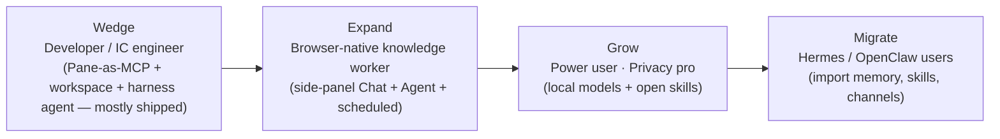
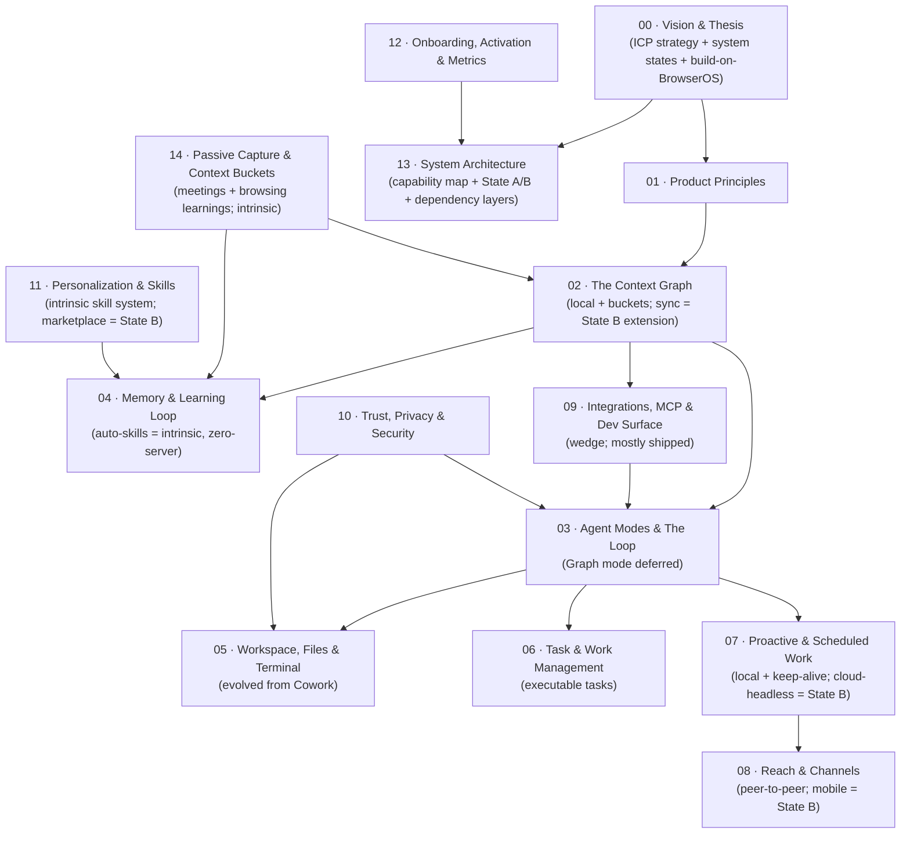

# Pane Product Specs

This folder holds the product specification for Pane's next phase: **Pane as a Hermes-class personal agent that happens to be your browser**.

These specs are written from a product-manager lens: who the product serves, what it does, how the pieces fit together, and how we measure success. They are design intent, not implementation contracts. For current implementation reality, see [ARCHITECTURE.md](../ARCHITECTURE.md) and [PRODUCT.md](../PRODUCT.md). For the **engineering design** that realizes these specs (grounded in the current fork, extensible to State B via interfaces only), see [ARCHITECTURE-DESIGN.md](./ARCHITECTURE-DESIGN.md).

> **Status: draft v0.4 — HoP review pass.** Two corrections from the user shape v0.3: (1) **think in systems, not implementation timelines** — the Pane fork starts as a pure open-source project with **no Pane-operated servers** (BrowserOS's sync/credits/Remote-Hermes/cloud-API surfaces are **disabled**); server-dependent things are *future, conditional extension points*; **auto-skill-creation is a day-one intrinsic local capability** that needs zero servers; (2) we **build on BrowserOS**, not from scratch — most of the wedge is already shipped. v0.3 added a flagship intrinsic capability: **passive capture & context buckets** ([14](./14-passive-capture-and-context-buckets.md)).
>
> **v0.4 (holistic HoP review)** tightened the set across strategy, ICPs, retention, trust, distribution, and feasibility: added the **daily-habit/retention loop + a north-star metric** ([12](./12-onboarding-activation-metrics.md)); a **researcher/student flow** under the knowledge-worker ICP + a concrete research bucket ([00](./00-vision-and-thesis.md), [14](./14-passive-capture-and-context-buckets.md)); a **"why a fork, not an extension" defense** and the **no-default-model tension** ([00](./00-vision-and-thesis.md)); **training-wheels/dry-run** for the scary consequence classes ([10](./10-trust-privacy-security.md), [03](./03-agent-modes-and-the-loop.md)); the **curation/pruning half** of the learning loop so the system gets smarter, not heavier ([04](./04-memory-and-learning-loop.md)); a **distribution/packaging/auto-update** section and an expanded risk register ([13](./13-roadmap.md)); and **performance-budget** enforcement in the resource-heavy specs ([02](./02-the-context-graph.md), [04](./04-memory-and-learning-loop.md), [14](./14-passive-capture-and-context-buckets.md)). Also fixed stale v0.2 content in [12](./12-onboarding-activation-metrics.md) that contradicted the "no servers / credits disabled" decision.

---

## The thesis in one paragraph

Most of your work already lives in your browser — your tabs, your logins, your docs, your dashboards, your tickets, your inboxes. So the agent that is supposed to help you with that work should live there too, not in a separate daemon you bolt a browser onto via CDP, and not in a closed cloud sidebar that ships your browsing to a vendor. Pane is that agent. Because Pane **is** the browser, it gets native, permissioned context on everything you do, plus your workspace, files, and terminal. It does everything an always-on self-improving agent like Hermes does — persistent memory, self-written skills, scheduled work, multi-channel reach — but with richer context and direct automation, instead of reaching for your work through plugins and a debug port.

---

## Build on BrowserOS, not from scratch

We are not greenfield. BrowserOS already ships the Chromium fork, the agent server with 53+ MCP tools, Chat/Agent modes, Cowork (files), scheduled tasks, smart nudges, Connect Apps (Klavis), **Pane-as-MCP + `browseros-cli` + harness agents** (the dev wedge, mostly shipped), BYOK/OAuth/local models, vertical tabs, ad blocking, and the eval harness. v0.46 pulled Skills/Soul/Memory back to rebuild.

The **net-new intrinsic work** is: the Context Graph (with **context buckets**), the Memory + **auto-skill-creation engine**, **passive capture (meeting recordings + browsing learnings)**, Workspaces (evolved from Cowork), Tasks, Triggers (evolved from scheduled tasks), Reach (peer-to-peer), and the Trust framework. Everything else extends what's there. See the capability map in [13 — System Architecture](./13-roadmap.md).

---

## System states: A (pure local) and B (optional servers)

The system is **complete and useful with no Pane-operated servers** (State A), and **designed to accept optional servers later** (State B) via defined extension points. Nothing in State A depends on a Pane server.

```mermaid
flowchart LR
    subgraph A [State A — pure OSS, no Pane servers]
        dir[Browser + agent server + 53 tools]
        graph[Context Graph + buckets: local SQLite/FTS5]
        mem[Memory + auto-skills: local files]
        capture[Passive capture: meetings + browsing learnings]
        ws[Workspaces + sandboxed terminal]
        tasks[Tasks + executable + triggers]
        sched[Scheduled work: in-app + OS keep-alive]
        reach[Reach: OS push + email + Telegram bot]
        trust[Trust framework: approvals + capture consent + audit]
        models[BYOK + OAuth + local models]
    end
    subgraph B [State B — optional Pane servers, future/conditional]
        sync[Cloud sync adapter]
        credits[Hosted credits adapter]
        market[Skills marketplace source]
        headless[Cloud-headless runner adapter]
        team[Team / shared-graph adapter]
    end
    A -. optional plugs in via no-server-fallback interfaces .- B
```

**The "becomes smarter every day" promise is fully delivered in State A.** The learning loop watches browser + workspace + terminal activity — including **passive capture** of meetings and browsing ([14](./14-passive-capture-and-context-buckets.md)) — and writes memory + `SKILL.md` files locally. No marketplace, no server, no account.

**State B — optional Pane servers, future and conditional.** Cloud sync, hosted credits, the hosted skills marketplace, the cloud-headless runner, and team features are **not shipped in the Pane fork today** — BrowserOS's Pane-operated server surfaces (sync, credits, Remote Hermes, the cloud API) are **disabled**. State B is a future possibility ("if Pane gets famous, we might add server-side integration"), not a present reality. The interfaces are defined only so a future server can plug in without redesigning the core, each behind a no-server fallback.

---

## The wedge, then expand

We pick a wedge ICP, win it, and expand in order. The first proof of the thesis is the **developer flow** — and it's mostly already shipped: point Claude Code at Pane via one MCP URL, reproduce a bug in your real session, fix it from the repo, re-verify. That slice must be excellent before we optimize the knowledge-worker flows.



See [00 — Vision](./00-vision-and-thesis.md) for the per-ICP problem statements and primary flows, and [13 — System Architecture](./13-roadmap.md) for the system model and dependency layers (not a timeline).

---

## How these specs fit together



The **Context Graph** (02) is the center of gravity, **partitioned into context buckets** (14). The **developer MCP + workspace surface** (09, 05) is the wedge that proves the thesis first — and it's mostly already shipped. **Passive capture** (14) is the purest "we are the browser" capability for the knowledge-worker ICP. Read 00, then 13 (system model), then 09 and 05 (the wedge), then 02 and 14 (the context system).

---

## Spec index

| # | Spec | What it defines |
|---|------|-----------------|
| 00 | [Vision & Thesis](./00-vision-and-thesis.md) | ICP strategy, per-ICP flows, **build on BrowserOS**, **system states A/B**, competitive defense, business model |
| 01 | [Product Principles](./01-product-principles.md) | Tenets every spec is judged against (incl. focus, performance, local-complete, build-on-substrate) |
| 02 | [The Context Graph](./02-the-context-graph.md) | Local graph + index + context tools; sync is a State B extension interface |
| 03 | [Agent Modes & The Loop](./03-agent-modes-and-the-loop.md) | Chat / Agent modes (Graph deferred), the tool loop, visibility, approvals, model routing |
| 04 | [Memory & Learning Loop](./04-memory-and-learning-loop.md) | **Auto-skill-creation as an intrinsic zero-server capability**; memory layers; browser-grounded learning |
| 05 | [Workspace, Files & Terminal](./05-workspace-files-terminal.md) | Evolved from Cowork: workspaces, sandboxed terminal, trust bar |
| 06 | [Task & Work Management](./06-task-and-work-management.md) | Executable tasks + inbox + triage (native kanban cut) |
| 07 | [Proactive & Scheduled Work](./07-proactive-and-scheduled-work.md) | Local + OS keep-alive; cloud-headless = State B extension point |
| 08 | [Reach & Channels](./08-reach-and-channels.md) | Peer-to-peer reach (OS push + email + Telegram); mobile companion = State B |
| 09 | [Integrations, MCP & Developer Surface](./09-integrations-mcp-developer-surface.md) | The wedge — mostly shipped: Connect Apps, Pane-as-MCP, harness agents, CLI |
| 10 | [Trust, Privacy & Security](./10-trust-privacy-security.md) | Local-first, prompt-injection defense, ICP-tunable approvals, fatigue guardrail |
| 11 | [Personalization & Skills](./11-personalization-skills-marketplace.md) | Intrinsic skill system + agentskills.io peer import; hosted marketplace = State B |
| 12 | [Onboarding, Activation & Metrics](./12-onboarding-activation-metrics.md) | ICP-specific paths, calibrated activation bars, success metrics |
| 13 | [System Architecture & Build Order](./13-roadmap.md) | **Not a timeline** — capability map, State A/B, dependency layers |
| 14 | [Passive Capture & Context Buckets](./14-passive-capture-and-context-buckets.md) | Meeting recordings + notes, browsing learnings, bucketed context — all intrinsic State A |
| — | [Architecture Design](./ARCHITECTURE-DESIGN.md) | **Engineering design** that realizes the specs, grounded in the current fork; intrinsic-only with State B extension-point interfaces. v0.4: expert-architecture review (process model & supervision, CDP-as-security-boundary, state-ownership boundary, loop discipline, platform matrix, degradation/observability/testing) + a full **disable & cleanup register** of BrowserOS defaults Pane doesn't need (product + tech). |
| — | [Implementation Plan](./IMPLEMENTATION-PLAN.md) | **End-to-end OSS build plan (State A only).** 7 phases, each shipping a usable product (Pane v0.1 → v1.0); each phase split into independently implementable + testable modules (what / how to build / how to test). State B planned separately after v1.0. |
| — | [Rebrand Plan (Step 0)](./REBRAND-PLAN.md) | **BrowserOS → Pane rebrand sweep.** Replaces every user-facing BrowserOS brand (icons from `assets/branding/pane-mark.svg` / `pane-wordmark.svg` + display text) across app, docs, CLI, native C++, Chromium icons, build/CI, and metadata. Splits product-brand (→ Pane) from substrate identifiers (tech debt) and infra (separate track), with a final ripgrep + visual QA gate. |

---

## How to read a spec

Each spec follows the same shape so they can be read in any order after 00, 01, and 13:

1. **Summary** — one paragraph, the elevator pitch.
2. **Goals / Non-goals** — what is and isn't in scope.
3. **User stories** — the jobs to be done.
4. **Spec** — the design: behavior, data model, UX, edge cases.
5. **Interactions** — how this spec depends on and feeds the others.
6. **Open questions** — unresolved decisions.
7. **Metrics** — how we know this worked.

Each spec anchors on **what BrowserOS already has** and separates **intrinsic (State A)** capability from **State B extension points**. When a spec conflicts with current shipped behavior (in `PRODUCT.md`), it states the intended future state and flags the delta.

---

## Status and ownership

These specs are **draft for review (v0.3)**. They are meant to be challenged. Each one ends with open questions that need a product decision before implementation begins. Nothing here is committed until it appears in [13 — System Architecture](./13-roadmap.md) with an owner.
